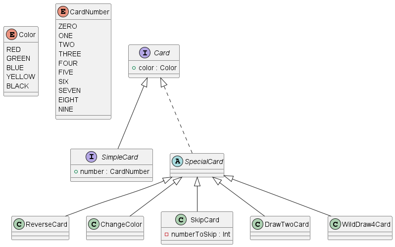
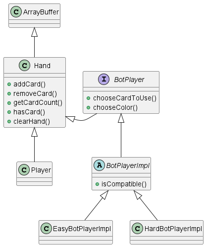
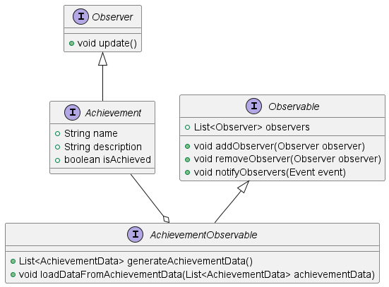

# Introduzione

Il progetto **Uno** mira alla creazione di un gioco di carte ispirato al famoso gioco UNO.

## Scopo del Gioco

L'obiettivo di ogni giocatore è terminare tutte le carte in mano per primo,
giocandole in base al colore o al numero dell'ultima carta giocata.

## Carte Semplici

Le carte semplici sono caratterizzate da un numero e un colore.
I colori disponibili delle carte sono rosso, giallo, verde e blu.
I numeri disponibili per ogni colore vanno da 0 a 9.
Tutte le carte risultano compatibili tra di loro se condividono lo stesso colore oppure hanno lo stesso numero.

## Carte Speciali

Nel gioco sono presenti delle carte speciali che non sono caratterizzate da un numero, ma
aggiungono vari elementi di strategia e sfida, tra cui:

- **Carte Pesca Due**: obbligano il prossimo giocatore a pescare due carte.
- **Carte Pesca Quattro**: obbligano il prossimo giocatore a pescare quattro carte e permettono di cambiare il colore in gioco.
- **Carte Salta Turno**: fanno saltare il turno al prossimo giocatore.
- **Carte Cambio Colore**: permettono di cambiare il colore in gioco.
- **Carte Cambio Giro**: invertono l'ordine dei turni.

Le carte Pesca Due, Salta Turno e Cambio Giro sono caratterizzate anche loro da uno dei quattro colori disponibili,
mentre le carte Pesca Quattro e Cambio Colore non hanno un colore associato e sono utilizzabili in qualsiasi momento.

## Modalità di Gioco

Ogni giocatore inizia la partita con un numero di carte in mano predefinito e il gioco procede in senso orario.
Una volta che un giocatore gioca una carta valida, il turno passa al giocatore successivo.
Se un giocatore non possiede in mano una carta valida, è obbligato a pescare una carta dal mazzo e terminare il suo turno.
Quando un giocatore si ritrova con una sola carta in mano, deve dichiarare "UNO" per avvertire gli altri giocatori.
Se un giocatore non dichiara "UNO" prima che il suo prossimo turno inizi, sarà penalizzato e dovrà pescare due carte.
Il gioco termina quando un giocatore gioca tutte le carte in mano.
Il gioco è progettato per essere giocato da un giocatore contro tre avversari controllati dal computer.

# Processo di sviluppo

Il processo di sviluppo del progetto è stato guidato da principi di agilità e collaborazione, seguendo la metodologia _Scrum_ e 
utilizzando strumenti e tecniche come _Test Driven Development (TDD)_, _Continuous Integration (CI)_, _Build Automation_ e _Quality Assurance_.

## Scrum

Scrum è un framework di gestione dei progetti e sviluppo del software che si basa su principi di agilità e collaborazione (Metodologia _Agile_). 

La metodologia si sviluppa attraverso iterazioni chiamate sprint. In ciascuno di essi, si introducono nuove funzionalità o si apportano miglioramenti al sistema esistente.

Ogni sprint è composto dalle seguenti attività:

- **Daily Scrum:** Durante il Daily Scrum, ciascun partecipante fornisce un aggiornamento su quanto è stato completato, ciò che si intende realizzare nella giornata e le eventuali problematiche o impedimenti incontrati.
- **Sprint Planning:** Viene definito un obiettivo chiaro per lo sprint e si sviluppa un piano dettagliato su come raggiungere tale obiettivo.

Al termine di ogni _sprint_ si esegue una revisione, che consente al team di adattare il lavoro in base ai feedback e ai cambiamenti delle esigenze. La revisione dello sprint è composta dalle seguenti attività:

- **Product Backlog review:** Durante questa revisione, il team di sviluppo e il Product Owner esaminano e riflettono sul contenuto del Product Backlog per assicurarsi che esso continui a rispondere alle esigenze del progetto.

- **Sprint Review:** Questo incontro ha lo scopo di dimostrare i risultati ottenuti, raccogliere feedback e discutere eventuali modifiche necessarie.

- **Sprint Retrospective:** Durante questa attività, il team riflette sulle esperienze dello sprint appena concluso, analizzando le pratiche adottate e i risultati ottenuti. L’obiettivo principale è identificare le aree di miglioramento e discutere modifiche ai processi e alle metodologie di lavoro.

### Suddivisone del lavoro

Nel nostro progetto si sono presentati tre ruoli principali:

- Product Owner: il cui compito é di verificare l'adeguatezza del sistema che si sta sviluppando, ruolo svolto da Pablo Sebastian Vargas Grateron.
- Scrum Master: il cui ruolo é quello di mediare tra il Product Owner e il Development Team, ruolo svolto da Nicola Montanari.
- Development Team: team che si occupa dello sviluppo del progetto e del testing, composto da:
  - Samuele De Tuglie
  - Pablo Sebastian Vargas Grateron
  - Nicola Montanari

## Test Driven Development (TDD)

Per questo progetto abbiamo scelto di seguire il metodo di sviluppo Test Driven Development (TDD). I benefici del TDD includono una maggiore qualità del codice grazie a una progettazione più modulare e meno dipendente. I test automatizzati forniscono un feedback immediato, aiutano a identificare e correggere rapidamente gli errori e fungono da documentazione vivente del sistema. Inoltre, permettono di apportare modifiche al codice con maggiore fiducia, sapendo che eventuali regressioni verranno rilevate rapidamente.

Il sviluppo TDD si divide in tre fasi:

1. **Prima fase:** Creazione dei test che falliscono.
2. **Seconda fase:** Scrivere il codice minimo per far passare il test.
3. **Terza fase:** Riffattorizzare il codice per migliorare la struttura del codice.

## Continuous Integration (CI)

Per il Continuous Integration abbiamo utilizzato _GitHub Actions_, implementando un _workflow_ che esegue il testing del codice ad ogni _push_ e _pull request_ per assicurare l'integrità e la correttezza del codice.

## Build Automation

Per automatizzare il testing e la release del progetto, abbiamo scelto di utilizzare _Simple Build Tool_ (sbt) grazie alla sua integrazione nativa con Scala e alla sua efficacia nella gestione delle dipendenze.

## Quality Assurance

Per garantire la coerenza e l'uniformità nel codice, è stato implementato un file di configurazione _scalafmt_. Questo file si occupa di applicare automaticamente le regole di formattazione stabilite, assicurando che il codice sorgente rispetti uno standard coerente e leggibile in tutte le parti del progetto.

# Requisiti e specifiche di progetto

## Business

L'obbiettivo del progetto è quello di creare una versione digitale del gioco di carte "Uno"
fornendo all'utente un'esperienza di gioco divertente e coinvolgente, offrendo diverse opzioni di gioco
contro dei bot a cui è possibile assegnare diverse difficoltà, grazie a un'interfaccia utente intuitiva
per migliorare ulteriormente l'esperienza di gioco.

## Modello di dominio

Il gioco "Uno" è un gioco di carte in cui i giocatori competono per essere i primi a esaurire tutte le carte nella propria mano. 
Il gioco si svolge in turni, durante i quali i giocatori giocano una carta dalla propria mano che corrisponde per colore o valore 
all'ultima carta giocata sul tavolo. Oltre alle carte numeriche, ci sono carte speciali che possono cambiare il colore, invertire 
il turno, saltare il turno del prossimo giocatore, o costringere gli avversari a pescare carte aggiuntive. Il primo giocatore a 
esaurire tutte le carte vince la partita. Se un giocatore rimane con una sola carta, deve dichiarare "Uno" per evitare penalità.

- **Carta:** Entità rappresentante una carta del mazzo di "Uno", con attributi come colore, valore, e tipo speciale (es. +2, +4, cambio di colore).
- **Mazzo:** Collezione di carte, contenente tutte le carte disponibili per la partita.
- **Giocatore:** Entità rappresentante un partecipante alla partita, che può essere un giocatore umano o un bot.
- **Mano:** Collezione di carte attualmente in possesso di un giocatore.
- **Partita:** Entità che rappresenta una singola sessione di gioco, contenente informazioni su giocatori, stato del gioco, e carte giocate.

## Funzionali

### Utente

- Gli utenti dovranno interagire con il sistema tramite un'interfaccia grafica (GUI).
- Gli utenti possono interagire col sistema effettuando diverse azioni:
  - Accedere al tutorial per apprendere le regole del gioco.
  - Modificare le regole personalizzate del gioco:
    - Impostare il numero di carte iniziali di ogni giocatore.
    - Impostare la difficoltà dei bot.
    - Impostare il livello di Handicap rispetto ai bot.
  - Visualizzare tutti gli achievement disponibili.
  - Individuare gli achievement sbloccati o da sbloccare.
  - Resettare gli achievement di gioco.
  - Iniziare una nuova partita selezionando l'opzione dal menù principale.
    - Durante una partita, è possibile effettuare le seguenti azioni:
      - Giocare una carta dalla propria mano durante il proprio turno.
      - Pescare una carta dal mazzo.
      - Dichiarare "UNO" quando si rimane con una sola carta in mano.
- Gli utenti possono visualizzare i diversi fattori che rappresentano lo stato attuale della partita:
    - Numero di carte in mano per ogni giocatore.
    - Il giocatore di turno.
    - La carta giocata più recentemente.
    - L'ordine dei turni.
    - Lo status del pulsante UNO.
    - Lo stato finale della partita.


### Di sistema

Il sistema software deve essere in grado di gestire correttamente l'intero game loop del gioco,
determinando lo stato della partita,
l'ordine dei turni e l'applicazione e il rispetto delle regole di gioco ad ogni mossa sia 
da parte del giocatore che da 
parte dei bot.
Inoltre è necessario che il sistema sia in grado di gestire la presenza di bot,
determinando la loro strategia di gioco in base
alle impostazioni di gioco e allo stato attuale della partita.
Mantenere lo stato corrente di ogni mano del giocatore, aggiornando le mani dei giocatori,
gestendo il mazzo e lo stato 
dell'ultima carta giocata in modo da garantire l'integrità della partita ad ogni turno.

## Non funzionali
L'interfaccia deve essere intuitiva e facilmente navigabile,
con chiare indicazioni su come eseguire le azioni di gioco. 
Il codice deve essere strutturato in modo modulare per facilitare 
l'aggiunta di nuove funzionalità, cambio di regole o aggiornamenti.

## Di implementazione

- Il gioco sarà implementato usando Scala 3.x
- Utilizzo di JDK 21

## Opzionali
 - Ulteriori regole personalizzate vincolate
   - Livello di Difficoltà dei Bot
   - Numero di carte iniziali per ogni giocatore

# Design architetturale

## Architettura complessiva
L'architettura complessiva è mostrata e riepilogata nel successivo diagramma UML:


Di seguito una breve descrizione per ogni componente illustrato:


- `Card` &rarr; Elemento principale del gioco, struttura base per ogni carta in gioco.
  - `SimpleCard` &rarr; Una carta semplice, che è caratterizzata da un colore e un numero.
  - `SpecialCard` &rarr; Una carta speciale, che ha un effetto particolare a seguito della propria giocata.


- `Deck` &rarr; Modello che rappresenta una collezione di carte non ordinata, semplici e speciali, che offre la possibilità di pescare da esso.
- `Hand` &rarr; Modello che anch'esso rappresenta una collezione di carte non ordinata, minore di quella del mazzo. Quest'ultimo componente è la
base di ogni giocatore e bot, in quanto rappresenta la mano di carte che ogni giocatore possiede durante una partita.


- `Player` &rarr; Componente che rappresenta un giocatore all'interno del gioco, che contiene una mano di carte gestibili durante una partita.
- `BotPlayer` &rarr; Unità fondamentale che rappresenta un bot generico, anch'esso presenta una mano gestibile, struttura base di ogni bot implementabile.


- `Achievement` &rarr; Componente che rappresenta un obiettivo da raggiungere durante una partita, che può essere di vario tipo.
- `AchievementObserver` &rarr; Interfaccia che rappresenta un osservatore di un obiettivo, che notifica il raggiungimento di un obiettivo.


- `GameLoop` &rarr; Componente cruciale che si occupa interamente di gestire e modellare la logica del gioco e il rispetto
delle regole durante lo svolgimento di ogni partita.
- `GameGui` &rarr; Interfaccia grafica in grado di mostrare le numerose interfacce
  presenti all'interno del programma quando viene richiesto.


## Pattern architetturali
Il pattern architetturale utilizzato per la creazione di questo progetto è MVC (Model-View-Controller).

Questo pattern è stato scelto in quanto permette di separare
la logica di business (Model) dalla interfaccia (View)
e dalla gestione degli eventi (Controller).
Questa separazione permette di rendere il codice più modulare e mantenibile,
in quanto ogni componente ha un compito ben definito e indipendente dagli altri.

All'interno del progetto, i package sono stati distribuiti proprio seguendo questo pattern architetturale:
- Controller
  - Contiene gli elementi che si occupano 
di gestire gli eventi del gioco e le azioni dei bot e dell'utente
- Model
  - Contiene i componenti principali necessari per lo svolgimento del gioco
- View
  - Contiene il necessario a formare quelle che saranno le interfacce grafiche del gioco

## Scelte tecnologiche
Per la realizzazione di questo progetto è stata utilizzata la versione 3.x di Scala. Per La gestione dei file in formato 
JSON è stato utilizzato il framework `Play-JSON`.

# Design di dettaglio

## Card
Una Card è un elemento chiave per l'intero svolgimento di una partita di UNO.
Una Carta è un elemento giocabile all'interno di una partita, che comprende dei valori e caratteristiche con
cui verranno effettuate delle operazioni o scelte durante lo svolgimento del gioco.

Una Card deve strettamente appartenere a uno dei seguenti tipi:
- `SimpleCard`
- `SpecialCard`

Sia le SimpleCard che le SpecialCard sono figlie dirette di Card.

La Card base è caratterizzata da due semplici attributi condivisi da tutte le carte:
- `color: Color` che rappresenta il colore della carta
- `image: Image` che rappresenta l'immagine della carta (ad uso esclusivamente grafico)

Per la gestione dei colori, onde evitare errori di tipo, si è deciso di creare un Enum `Color`
che rappresenta i colori possibili di una carta.



### SimpleCard
Una SimpleCard è una carta base, che non ha particolari effetti o abilità speciali, è figlia diretta di Card e quindi 
eredita direttamente i suoi attributi, di cui principale importanza è il campo 'color', fondamentale nella 
gestione attiva del gioco.

Una SimpleCard ha poi modellato un altro attributo interno, che rappresenta il valore numerico della carta.
Quest'ultimo viene modellato tramite l'attributo `num: CardNumber`.


Nonostante il valore numerico sia un semplice intero, si è deciso di creare un Enum `CardNumber` che rappresenta esclusivamente
i valori possibili all'interno del gioco di Uno.
Questa scelta è stata fatta sia per evitare errori di tipo, sia per rendere il codice più leggibile e comprensibile, 
che per garantire una maggiore scalabilità del codice in futuro.

### SpecialCard
Una SpecialCard è una carta speciale, che è caratterizzata dalla presenza di un effetto particolare una volta che
un giocatore la gioca.

Anche la SpecialCard è figlia diretta di Card e quindi eredita direttamente i suoi attributi, 
di cui principale importanza è il campo 'color'.

L'unico particolare per quanto riguarda il colore delle SpecialCard è che alcune di esse
sono caratterizzate dal colore `BLACK`, che rappresenta un colore speciale.
Quest'ultimo risulta compatibile con tutti gli altri 4 colori disponibili.
Inoltre, le carte caratterizzate dal colore `BLACK` hanno la particolarità di cambiare colore a piacimento una volta
giocate.

Ogni SpecialCard ha al suo interno un metodo `execute` con lo scopo di avvisare il Controller 
del gioco di quale azione deve essere eseguita una volta che la carta viene giocata.
Ogni tipo di SpecialCard differente eseguirà l'override di questo metodo per eseguire l'azione corretta.


Sono presenti quattro tipi di SpecialCard, ognuna con un effetto diverso e unico: 
#### DrawCard
La DrawCard è una carta speciale che obbliga il giocatore successivo a pescare un numero di carte definito.

Esistono due tipi di DrawCard:
- `DrawTwoCard` che obbliga il giocatore successivo a pescare due carte. La carta è caratterizzata da uno dei 4
colori disponibili nel gioco.
- `DrawFourCard` che obbliga il giocatore successivo a pescare quattro carte. La carta è caratterizzata dal colore `BLACK` 
e ha la particolarità di cambiare il colore in gioco a piacimento una volta giocata.

#### SkipCard
La SkipCard è una carta speciale che obbliga il giocatore successivo a saltare il proprio turno.
Questa Carta notifica al Controller di saltare il turno del giocatore successivo, tramite il metodo `execute`.

Nel gioco base di UNO, una carta SkipCard fa saltare un solo turno, nel nostro progetto è
stato aggiunto un valore `numberToSkip: int` che rappresenta il numero di turni da saltare, nel caso si vogliano
modificare le regole di gioco in un futuro momento senza cambiare la struttura del codice.

Questa SpecialCard può essere caratterizzata dai 4 classici colori disponibili nel gioco.

#### ReverseCard
La ReverseCard è una carta speciale che inverte l'ordine di gioco attuale, da orario ad antiorario o viceversa.
Questa Carta notifica al Controller del cambiamento d'ordine tramite il metodo `execute`.

Questa SpecialCard può essere caratterizzata dai 4 classici colori disponibili nel gioco.

#### ChangeColor
La ChangeColor è una carta speciale che permette al giocatore di cambiare il colore in gioco a piacimento.

La carta è caratterizzata dal colore `BLACK`
e ha la particolarità di cambiare il colore in gioco a piacimento una volta giocata.

Questa Carta notifica al Controller della richiesta di cambio di colore tramite il metodo `execute`.

### Deck
Il Deck è una collezione di carte, che rappresenta il mazzo di carte da cui i giocatori pescano durante il gioco.

Durante la fase di inizializzazione del gioco, il Deck viene creato e autometicamente popolato 
da tutte le carte necessarie per una partita di UNO:

Si gioca con un mazzo di 108 carte così distribuite:
- 19 Carte per ogni colore disponibile (`Red`, `Blue`, `Green`, `Yellow`), numerate da 1 a 9 (2 serie) più uno 0
- 8 carte `DrawTwo` dei quattro colori sopracitati
- 8 carte `ReverseCard` dei quattro colori sopracitati
- 8 carte `SkipCard` dei quattro colori sopracitati
- 4 carte `ChangeColor`
- 4 carte `DrawFour`

Una volta create, le carte vengono mescolate in modo casuale.

Il Deck offre la possibilità di pescare una carta, rimuovendola dal mazzo, tramite il metodo `draw`, che ritorna poi
la carta pescata.

### Hand
Una Hand è una collezione di carte, che rappresenta la mano di un giocatore durante il gioco.
Una Hand è la base fondamentale sia per quanto riguarda il giocatore ma anche per i bot che partecipano alla partita.

Una Hand comprende le funzionalità necessarie alla gestione completa delle carte in essa contenute:

- `addCard` Aggiunge una carta alla mano.
- `removeCard` Rimuove una carta dalla mano.
- `getCardCount` Ritorna il numero di carte presenti nella mano.
- `hasCard` Verifica se una carta precisa è attualmente presente nella mano.
- `clearHand` Rimuove tutte le carte dalla mano, svuotandola.

### Player
Un Player è un giocatore umano e partecipante attivo alla partita di UNO.

Un Player è semplicemente un figlio diretto di Hand e viene gestito in maniera diretta dal Controller del gioco.

## Bots
A seguire un UML che mostra come sono strutturate le classi dei Bot:



## BotPlayer
Un BotPlayer è un giocatore non umano alla partita di UNO.
Anche il BotPlayer è un figlio diretto di Hand.
Viene gestito in maniera diretta dal Controller del gioco, le sue scelte e i suoi 
comportamenti sono completamente automatizzati.

Un BotPlayer non è direttamente istanziabile, ma è necessario utilizzare una delle due classi figlie:
- `EasyBotPlayerImpl`
- `HardBotPlayerImpl`

BotPlayer contiene due metodi comuni e fondamentali per lo svolgimento del gioco:
- `chooseCardToUse` che ritorna la carta scelta dal BotPlayer per essere giocata, se possibile e valida.
- `chooseColor` che ritorna il colore scelto dal BotPlayer in caso di carta `ChangeColor` o `DrawFour`.

### EasyBotPlayer
Un EasyBotPlayer è un BotPlayer che gioca in maniera casuale, senza particolari strategie o logiche.
La difficoltà di gioco è molto bassa, e il BotPlayer sceglie le carte da giocare in maniera casuale,
analizzando le
carte in mano con quella al centro del tavolo.
EasyBotPlayer non tiene conto del numero di carte degli altri giocatori e per giocare sceglie
semplicemente una carta casuale valida che possa essere giocata nel suo turno.
Nel caso non possieda alcuna carta valida da giocare, pesca una carta.

Per effettuare questa scelta, questa variante di BotPlayer effettua l'override del metodo `chooseCardToUse`, presente
nella classe BotPlayer, in modo da poter effettuare una scelta casuale tra le carte in mano.

### HardBotPlayer
Un HardBotPlayer è un BotPlayer che gioca in maniera più strategica e intelligente, cercando di massimizzare
le proprie possibilità di vittoria.

La strategia principale di un HardBotPlayer è quella di giocare le carte speciali per prima,
cercando di danneggiare gli avversari e di ottenere un vantaggio quando possibile.
HardBotPlayer non tiene conto del numero di carte degli altri giocatori e per giocare sceglie
semplicemente una carta valida che possa essere giocata nel suo turno in base alla sua strategia precedentemente
descritta.
Nel caso non possieda alcuna carta valida da giocare, pesca una carta.

Per effettuare questa scelta, questa variante di BotPlayer effettua l'override 
del metodo `chooseCardToUse`, presente
nella classe BotPlayer, in modo da poter effettuare una scelta accurata tra le carte in mano.

### Compatibility
Per regolare la compatibilità delle carte in gioco, è stato sviluppato un metodo
`isCompatible` che verifica se una carta è compatibile con la carta attualmente in gioco.

La verifica avviene in base a tutti i criteri possibili:
- Tipo di carta (SimpleCard o SpecialCard)
- Colore
- Numero (se presente)

## Achievements

Gli _Achievements_ sono obiettivi che i giocatori possono raggiungere durante una partita di UNO,
che vengono registrati e valutati dopo aver concluso una partita. La progettazione degli achievement è stata fatta
seguendo il pattern Observer, in modo da garantire una gestione modulare e flessibile degli obiettivi.



Nel diagramma si può osservare la struttura dei principali componenti che compongono il sistema di Achievements:
- `Achievement` &rarr; Interfaccia che definisce i metodi necessari per la gestione degli obiettivi.
- `AchievementObservable` &rarr; Interfaccia che definisce i metodi per la registrazione e la notifica degli osservatori.

Quando un evento di gioco si verifica, gli oggetti `Achievement` registrati come osservatori vengono notificati e 
valutano se l'obiettivo associato è stato raggiunto, aggiornando il proprio stato di conseguenza.

L'interfaccia `AchievementObservable` fornisce anche dei metodi per ottenere o caricare gli obiettivi raggiunti,
in modo da poter gestire uno storico delle prestazioni dei giocatori.

### AchievementController

Per gestire il caricamento, il salvataggio e la visualizzazione degli obiettivi del gioco, è stato progettato un
`AchievementController`, che coordina tutte le operazioni relative agli obiettivi. Questo controller centralizza 
le operazioni principali associate agli obiettivi, garantendo un'interfaccia unificata per la gestione degli stessi.

Le funzioni principali del `AchievementController` includono:
- Tiene traccia dei progressi di un giocatore e aggiorna gli obiettivi raggiunti in base agli eventi di gioco.
- Recupera gli obiettivi già raggiunti da un giocatore, leggendo i dati di salvataggio da un file.
- Registra e memorizza lo stato attuale degli obiettivi raggiunti da un giocatore.
- Fornisce un elenco aggiornato degli obiettivi che un giocatore ha sbloccato.
- Ripristina lo stato degli obiettivi, consentendo di riavviare il progresso degli stessi come se fosse una nuova sessione.

Un aspetto chiave dell'implementazione del `AchievementController` è la separazione tra la logica degli obiettivi e i 
dati di salvataggio. Questo significa che la definizione di cosa costituisce un obiettivo e le regole che determinano 
il suo raggiungimento sono mantenute separate dalle informazioni che memorizzano quali obiettivi sono stati 
effettivamente sbloccati da un giocatore e in che stato si trovano.

Un ulteriore vantaggio di questo approccio è la robustezza nella gestione del caricamento dei dati degli obiettivi. 
Anche se in future versioni del gioco vengono definiti nuovi obiettivi, i dati di salvataggio delle versioni 
precedenti rimangono pienamente compatibili. Ciò è possibile perché il caricamento dei dati degli obiettivi avviene 
in base all'id univoco di ciascun obiettivo. Di conseguenza, i progressi di un giocatore possono essere correttamente 
mappati ai rispettivi obiettivi anche dopo l'introduzione di nuovi traguardi.

## Settings

Le impostazioni di gioco sono modellate attraverso un oggetto `Settings` che contiene i parametri principali:
- `difficulty`: Il livello di difficoltà del gioco, che è rappresentato da un enum.
- `startCardValue`: Il valore del numero di carte iniziali di tutti i giocatori.
- `handicap`: Un valore di handicap applicato al gioco per i bot, il quale può essere negativo o positivo.

L'oggetto deve essere serializzabile, in modo da poter essere salvato e caricato da file.

### SettingsManager e SettingsController

Le impostazioni di gioco sono gestite attraverso due componenti principali:
- `SettingsManager` &rarr; Si occupa di gestire il salvataggio e il caricamento delle impostazioni da file.
- `SettingsController` &rarr; Si occupa di gestire le operazioni connesse alle impostazioni, come la modifica e il salvataggio 
in un determinato path o richiamare il `SettingsManager` per il caricamento e il salvataggio delle impostazioni nel momento
opportuno.

## GameLoop
Il GameLoop è il cuore della logica del gioco, responsabile della gestione delle dinamiche di gioco, 
delle diverse fasi e delle interazioni tra i giocatori. I suoi metodi principali includono:

- `start` &rarr; Avvia il gioco, occupandosi dell'inizializzazione del mazzo di carte, della distribuzione delle mani ai giocatori e della preparazione del tavolo di gioco.
- `stop` &rarr; Termina il gioco e gestisce le operazioni di chiusura necessarie.
- `reverseTurnOrder` &rarr; Inverte l'ordine dei turni dei giocatori.
- `nextDrawCard` &rarr; Fa pescare un numero specifico di carte al giocatore successivo.
- `skipNextTurn` &rarr; Salta il turno del prossimo giocatore.
- `chooseCard` &rarr; Gioca una carta dalla mano del giocatore, se valida, e la rimuove dalla mano del giocatore.
- `drawCard` &rarr; Fa pescare una carta al giocatore di turno.
- `showChangeColor` &rarr; Mostra un'interfaccia per permettere al giocatore di selezionare un nuovo colore di gioco.
- `changeColor` &rarr; Cambia il colore attivo nel gioco in base alla scelta del giocatore.
- `callUno` &rarr; Gestisce la dichiarazione di "UNO" da parte del giocatore.
- `nextTurn` &rarr; Passa il turno al giocatore successivo.

## PageController
La PageController è una classe fondamentale per la gestione della navigazione e della visualizzazione delle 
diverse schermate all'interno dell'applicazione di gioco. Essa centralizza il controllo delle interfacce grafiche, 
rendendo fluide le transizioni tra le varie schermate e coordinando le operazioni connesse al ciclo di gioco. 
Grazie a questa struttura modulare, l'applicazione può essere facilmente estesa con nuove schermate
senza compromettere il flusso complessivo del programma.

## GameGui

La gui del gioco è stata sviluppata in modo da essere il più possibile intuitiva e semplice da utilizzare.
Si basa su una griglia di bottoni, di cui:
- l'ultima riga è dedicata alle carte del giocatore attuale.
- Vicino al centro é presente il mazzo di carte, l'ultima carta giocata e il bottone per chiamare uno.
- In alto a destra é presente un'immagine che rappresenta la direzione del gioco.
- Sopra ogni giocatore é presente una freccia che si rende visibile quando é il turno di quel giocatore.

# Implementazione

## Montanari Nicola

### Hand

Lo sviluppo della classe `Hand` è stato fondamentale per la gestione delle carte in gioco.

Per la sua implementazione è stato definito un nuovo `trait` che estende `ArrayBuffer[Card]`
così da garantire e gestire i metodi necessari per la gestione degli elementi al suo interno.

Questo componente è strutturato per garantire le funzionalità fondamentali per la gestione delle carte in gioco.
È stata implementata una metodologia di sviluppo che minimizzasse la complessità affinché il codice possa essere
il più chiaro e leggibile possibile, sopratutto per questo componente fondamentale per questo progetto.

Ogni metodo necessario si basa sulle funzionalità offerte da `ArrayBuffer` e viene implementato 
all'interno del trait come mostrato successivamente:


```scala
trait Hand extends ArrayBuffer[Card]:

  def addCard(card: Card): Unit = this += card

  def removeCard(card: Card): Boolean =
    if this.contains(card) then
      this -= card
      true
    else false

  def getCardCount: Int = this.size

  def hasCard(card: Card): Boolean = this.contains(card)

  def clearHand(): Unit = this.clear
  
```

### Player

Per suddividere i giocatori umani dai bot, è stata definita una classe `Player` che estende `Hand`.
Il controller del gioco gestirà in maniera diretta il giocatore umano differentemente da come gestirà i bot.

L'implementazione del Player non è altro che un oggetto che estende `Hand`, in quanto presenta già tutte
le funzionalità necessarie per gestire i comportamenti di un giocatore all'interno di una partita.

```scala
object Player extends Hand
```

### BotPlayer e BotPlayerImpl

Per gestire i bot all'interno del gioco, è stata definito un trait generale `BotPlayer` che estende anch'esso `Hand` così da
ereditare tutte le sue funzionalità, proprio come la classe `Player`.

Il trait `BotPlayer` presenta due metodi fondamentali per il gioco:
- `chooseCardToUse` che ritorna la carta scelta dal BotPlayer per essere giocata, se possibile e valida.
- `chooseColor` che automatizza e ritorna il colore scelto dal BotPlayer in caso di necessità.

```scala

trait BotPlayer extends Hand:
  def chooseCardToUse(card: Card): Option[Card]
  def chooseColor(): Color
  
 ```

Per implementare i bot, il trait `BotPlayer` è stato esteso in una classe astratta `BotPlayerImpl` 
che implementa i metodi precedenti, oltre
che a definire un metodo `isCompatible` che verifica la compatibilità tra due carte, 
così da renderlo disponibile ai propri figli.

Il metodo `isCompatible` è stato definito poi esternamente e contiene la logica per la verifica.
Questo metodo ritorna un booleano che indica se la carta selezionata è compatibile con la carta al centro del tavolo.

Il metodo `chooseColor` è stato implementato in modo da selezionare il colore più frequente tra le carte in mano
così da ritornarlo quando il controller lo richiede, automatizzando così la scelta.
Questo metodo è generale per tutti i bot implementabili e quindi condiviso all'interno di questa classe.

Il metodo `chooseCardToUse` viene invece modellato in maniera separata e diversa per ogni tipologia di 
bot, in quanto la scelta della carta viene influenzata in
base alla strategia di gioco che il bot deve seguire.

A seguire l'implementazione di `BotPlayerImpl`:

```scala
abstract class BotPlayerImpl extends BotPlayer:

  protected def isCompatible(selectedCard: Card, centerCard: Card): Boolean =
  Compatibility.isCompatible(selectedCard, centerCard)
  
  override def chooseColor(): Color =
    val colorCounts = mutable.Map[Color, Int]().withDefaultValue(0)
        for card <- this do colorCounts(card.color) += 1
        if colorCounts.isEmpty then return Random.shuffle(Color.values.filterNot(_ == Color.Black).toList).head
        val sortedColors = colorCounts.toSeq.sortBy(-_(1))
        val mostFrequent = sortedColors.head(0)
        if mostFrequent == Color.Black then Random.shuffle(Color.values.filterNot(_ == Color.Black)).toList.head
        else mostFrequent
 ```
### EasyBotPlayerImpl
`EasyBotPlayer` è un `BotPlayerImpl` che gioca in maniera casuale, senza particolari strategie o logiche.

In questa implementazione, è stato necessario solo la ridefinizione del
metodo `chooseCardToUse` in modo da poter effettuare una scelta casuale tra le carte in mano.

Per implementare questa scelta, il metodo `chooseCardToUse` ricerca le carte compatibili con quella al centro del tavolo, 
se ne esistono, ne seleziona una casuale e la ritorna sfruttando `Some`, altrimenti ritorna `None`.

```scala
class EasyBotPlayerImpl extends BotPlayerImpl:
  override def chooseCardToUse(centerCard: Card): Option[Card] =
    val compatibleCards = this.filter(
      c => isCompatible(c, centerCard)
    )
    if compatibleCards.nonEmpty then
      val card = compatibleCards.head
      Some(card)
    else None
```
### HardBotPlayerImpl
`HardBotPlayer` è un `BotPlayerImpl` che gioca in maniera più strategica e intelligente, cercando di massimizzare le
proprie possibilità di vittoria.

In questa implementazione, è stato necessario solo la ridefinizione del
metodo `chooseCardToUse`, con lo scopo di selezionare le SpecialCard prima delle altre, 
in modo da danneggiare gli avversari e ottenere un vantaggio.

Per implementare questa scelta, il metodo `chooseCardToUse` ricerca le carte compatibili con quella 
al centro del tavolo,
se ne esistono, ricerca all'interno di questa lista se sono presenti delle carte speciali.
Nel caso di un riscontro positivo, viene scelta e ritornata la prima carta speciale trovata.
Altrimenti, se non sono presenti carte speciali nelle carte compatibili,
ne seleziona una casuale e la ritorna sfruttando `Some`.
Nel caso invece che non ci siano carte compatibili, ritorna `None`.

```scala
class HardBotPlayerImpl extends BotPlayerImpl:
  override def chooseCardToUse(centerCard: Card): Option[Card] =
    val compatibleCards = this.filter(
      c => isCompatible(c, centerCard)
    )
    if compatibleCards.nonEmpty then
      val specialCards = compatibleCards.filter(
        c => c.isInstanceOf[SpecialCard]
      )
      if specialCards.nonEmpty then
        val card = specialCards.head
        Some(card)
      else
        val card = compatibleCards.head
        Some(card)
    else None
```

### Compatibility
Con lo scopo di rispettare regolamentare la compatibilità delle carte in gioco,
è stato sviluppato un metodo
`isCompatible` che verifica se una carta è compatibile con una determinata carta 
(quella attualmente in gioco al centro del tavolo).

Questa funzione è stata volutamente implementata esternamente e in maniera più semplice e chiara possibile.
Questa funzione regola la compatibilità all'interno dell'intero flusso di gioco.
Nel caso futuro in cui si volessero cambiare le regole di gioco, basta effettuare delle modifiche a questo
metodo per variare la compatibilità tra le carte in gioco in maniera facile e veloce.

La verifica avviene in base a tutti i criteri possibili:
- Tipo di carta (SimpleCard o SpecialCard)
- Colore (Compreso anche il colore `BLACK`)
- Numero (se presente)

Durante la verifica vengono comparati i vari criteri.
Appena viene rilevato un criterio compatibile, la funzione ritorna `true`.
Nel momento in cui si finiscono i criteri da controllare, il metodo ritorna `false`.

```scala
def isCompatible(selectedCard: Card, centerCard: Card): Boolean =
  (selectedCard, centerCard) match
  case (s, c) if s.color == Color.Black || c.color == Color.Black        => true
  case (s, c) if s.color == c.color                                      => true
  case (s: SimpleCard, c: SimpleCard) if s.num == c.num                  => true
  case (s, c) if s.getClass == c.getClass && !s.isInstanceOf[SimpleCard] => true
  case _                                                                 => false
```

### Tutorial (GUI)
È stata sviluppata una GUI molto semplice per il tutorial del gioco.

Il tutorial è stato implementato in modo da guidare l'utente e mostrare tutte le possibili interazioni
all'interno del gioco tramite una serie di immagini e testi.

Per sviluppare le varie schermate del tutorial, è stata sviluppata una classe generica
`GeneralTutorialSlide` che contiene un'immagine, un titolo e una descrizione.

```scala
class GeneralTutorialSlide(val image: Image, val title: String, val description: String)
```

Successivamente, è stata implementata una factory che generi le varie schermate del tutorial quando necessario

```scala
class TutorialSlideFactory:
    def createCardSlide(): GeneralTutorialSlide =
        new GeneralTutorialSlide(
        ImageHandler.chooseCard,
        "How to choose a Card",
        "Click a card in your hand to play it when it's your turn"
        )
    
    def createDeckSlide(): GeneralTutorialSlide =
        new GeneralTutorialSlide(
        ImageHandler.drawCard,
        "How to Draw a Card",
        "Draw a card from the deck if you can’t play any of your current cards"
        )
    
    def createCompatibilitySlide(): GeneralTutorialSlide =
        new GeneralTutorialSlide(
        ImageHandler.cardCompatibility,
        "Card Compatibility",
        "Play cards that match the color or number of the top card on the discard pile"
        )
    
    def createUnoSlide(): GeneralTutorialSlide =
        new GeneralTutorialSlide(
        ImageHandler.UnoPress,
        "How to call UNO",
        "Announce \"UNO\" when you have only one card left to avoid a penalty"
        )
    
    def createWinLoseSlide(): GeneralTutorialSlide =
        new GeneralTutorialSlide(
        ImageHandler.tutorialWin,
        "How to Win a Game",
        "Be the first to play all your cards to win the game"
        )
    
    def createSpecialCardSlide(): GeneralTutorialSlide =
        new GeneralTutorialSlide(
        ImageHandler.specialCards,
        "Special Cards",
        "Use special cards like Skip, Wild, Reverse, Draw +2 or +4 to alter the game and challenge your opponents"
        )
```

La precedente Factory viene poi sfruttata nella classe principale della gui, che procederà a generare ogni singola
slide e inserirla poi in un Array, così da poterle visualizzare e gestire in sequenza.
La scelta di questa struttura è stata fatta per garantire una maggiore scalabilità e facilità di gestione delle varie slide,
in un futuro in cui si volessero aggiungere nuove schermate dopo l'aggiunta di nuove funzionalità.


Per ogni slide contenuta nell'Array,
viene creata una schermata all'interno della pagina del tutorial, ordinata in base
all'ordine di inserimento all'interno dell'Array.

```scala
private val SlideFactory = new TutorialSlideFactory()
private val slides = Array(
  SlideFactory.createCompatibilitySlide(),
  SlideFactory.createSpecialCardSlide(),
  SlideFactory.createCardSlide(),
  SlideFactory.createDeckSlide(),
  SlideFactory.createUnoSlide(),
  SlideFactory.createWinLoseSlide()
)
```

Per mostrare una slide, è stato implementato un metodo `showSlide` che si occupa di mostrare i contenuti della 
slide richiesta all'interno dell'interfaccia.


```scala
private def showSlide(index: Int): Unit =
  if index >= 0 && index < slides.length then
      prevButton.setEnabled(index != 0)
      nextButton.setEnabled(index != slides.length - 1)
      currentSlideIndex = index
      val slide = slides(index)
      titleLabel.setText(slide.title)
      imageLabel.setIcon(new ImageIcon(slide.image))
      descriptionLabel.setText(slide.description)
```


## Componenti Sviluppati da Nicola Montanari e Samuele De Tuglie

### GameLoop

Il `GameLoop` è il componente principale del gioco; si occupa di gestire il flusso di gioco e le interazioni tra 
i vari componenti. Questo include la gestione dei turni, la gestione delle carte in mano ai giocatori
e alle interazioni che avvengono tra i giocatori.

Il suo metodo principale è `nextTurn` che si occupa di gestire il turno successivo, controllando il tipo di giocatore
che deve giocare e gestendo le azioni di gioco.

```scala
  private def nextTurn(): Unit =
      if !isRunning then return
      Future:
        currentTurn = (currentTurn + (if clockWiseDirection then 1 else -1) + turnOrder.size) % turnOrder.size
        gameGui.updateTurnArrow(currentTurn)
        turnOrder(currentTurn) match
          case bot: BotPlayer =>
            gameGui.allowPlayerAction(false)
            Thread.sleep((1500 + Random.nextInt(1500)).toLong)
            bot.chooseCardToUse(lastPlayedCard) match
              case Some(card) => chooseCard(card, bot)
              case None       => drawCard(bot)
          case _ => gameGui.allowPlayerAction(true)
```

Sostanzialmente, una volta che si assicura che il gioco sia in corso, controllando la variabile `isRunning`,
il metodo procede a calcolare il prossimo turno, mostrando sul tavolo di gioco la freccia che indica il giocatore corrente.
Successivamente, controlla il tipo di giocatore che deve giocare:
- Se è un bot, il gioco disabilita le azioni del giocatore e attende un tempo casuale (compreso tra 1,5 e 3 sec) prima di far giocare il bot.
Nel caso in cui il bot abbia scelto una carta da giocare, il bot la gioca, altrimenti pesca una carta.
- Se è un giocatore umano, il gioco abilita le azioni del giocatore.

Le carte speciali in UNO, come la carta `WildDrawFourCard` o la `ChangeColor`, eseguono azioni specifiche che influenzano il flusso di gioco. 
Il metodo `checkIfSpecialCard` identifica se la carta giocata è una carta speciale e, in tal caso, esegue l'azione corrispondente.

```scala
  private def checkIfSpecialCard(card: Card, isPlayer: Boolean = false): Unit =
    gameGui.updateGui()
    card match
      case c: WildDrawFourCard if c.color == Color.Black && isPlayer =>
        AchievementController.notifyAchievements(Event(AchievementId.FirstPlus4Achievement.id, true))
        c.execute()
      case c: ChangeColor if c.color == Color.Black && isPlayer =>
        AchievementController.notifyAchievements(Event(AchievementId.FirstColorChangeAchievement.id, true))
        c.execute()
      case c: SpecialCard => c.execute()
      case _              => ()
```
Nel caso in cui la carta giocata sia una carta speciale, il metodo `execute` della carta viene chiamato, eseguendo l'azione corrispondente.

Infine il `GameLoop` si occupa di gestire la pressione del bottone `Uno` e di gestire le azioni che ne conseguono.

```scala
  def callUno(): Unit =
    if player.getCardCount == 1 then
      unoCalled = true
      gameGui.setUnoButtonChecked(true)

  private def checkUno(): Unit =
    if !unoCalled && player.getCardCount == 1 then unoNotCalled()
    unoCalled = false
    gameGui.setUnoButtonChecked(false)
```
## Samuele De Tuglie

### Card

Lo sviluppo della classe `Card` é stato fondamentale per il funzionamento del gioco.

Di carte ne esistono di due tipologie: `SimpleCard` e `SpecialCard`. Siccome sia le carte semplici che le carte speciali
sono caratterizzate da un colore, si é deciso di creare un trait `Card` formato da un campo `color` di tipo `Color`.

```scala
trait Card:

  def color: Color

  def image: Image
```

I colori disponibili sono stati definiti in un enum `Color` che contiene i colori base del gioco.

```scala
enum Color(val rgb: Int):
  case Red extends Color(0xff0000)
  case Green extends Color(0x00ff00)
  case Blue extends Color(0x0000ff)
  case Yellow extends Color(0xffff00)
  case Black extends Color(0x000000)
```

#### SimpleCard
Le `SimpleCard` sono le carte normali del gioco, caratterizzate da un numero e da un colore.

```scala

trait SimpleCard extends Card:
  
  def num: CardNumber

object SimpleCard:
  def apply(num: CardNumber, color: Color): SimpleCard =
    SimpleCardImpl(num, color, loadCardImage(num.value.toString, color))
```

Per indicare il numero della carta, si é deciso di creare un enum `CardNumber` che contiene i numeri delle carte.

```scala
enum CardNumber(val value: Int):
  case Zero extends CardNumber(0)
  case One extends CardNumber(1)
  case Two extends CardNumber(2)
  case Three extends CardNumber(3)
  case Four extends CardNumber(4)
  case Five extends CardNumber(5)
  case Six extends CardNumber(6)
  case Seven extends CardNumber(7)
  case Eight extends CardNumber(8)
  case Nine extends CardNumber(9)
```

#### SpecialCard

Le `SpecialCard` sono le carte speciali del gioco, caratterizzate da un colore, da un'immagine e da un metodo `execute`
che verrà chiamato quando la carta verrà giocata.


```scala

abstract class SpecialCard(val color: Color, val image: Image) extends Card:
  def execute(): Unit

object SpecialCard:
  var gameLoop: GameLoop = _
  
  case class ChangeColor(override val color: Color = Color.Black) extends SpecialCard(color, loadCardImage("Wild", color)):
    override def toString: String = "ChangeColor " + color.toString
    override def execute(): Unit = gameLoop.showChangeColor()
  
  case class ReverseCard(override val color: Color) extends SpecialCard(color, loadCardImage("Reverse", color)):
    override def toString: String = "Reverse " + color.toString
    override def execute(): Unit = gameLoop.reverseTurnOrder()


  case class SkipCard(override val color: Color, numberToSkip: Int = 1) extends SpecialCard(color, loadCardImage("Skip", color)):
    override def toString: String = "Skip " + color.toString
    override def execute(): Unit = gameLoop.skipNextTurn(numberToSkip)


  case class WildDrawFourCard(override val color: Color = Color.Black) extends SpecialCard(color, loadCardImage("Draw4", color)):
    override def toString: String = "Draw 4" + " " + color.toString
    override def execute(): Unit = gameLoop.nextDrawCard(4)

  case class DrawTwoCard(override val color: Color) extends SpecialCard(color, loadCardImage("Draw2", color)):
    override def toString: String = "Draw 2" + " " + color.toString
    override def execute(): Unit = gameLoop.nextDrawCard(2)
```

Qui sono state definite le carte speciali `ChangeColor`, `ReverseCard`, `SkipCard`, `WildDrawFourCard` e `DrawTwoCard`.
Di base la carta `ChangeColor` e la carta `WildDrawFourCard` sono di colore nero, tuttavia una volta giocate
il giocatore può scegliere il colore che preferisce.

### Deck

Il `Deck` é una collezione di carte non ordinata, inizialmente composto da tutte le carte del gioco.

```scala
class Deck extends ArrayBuffer[Card]:

  for color <- Color.values if color != Color.Black do
    this += SimpleCard(CardNumber.Zero, color)
    for _ <- 0 to 1 do
      this += SkipCard(color)
      this += ReverseCard(color)
      this += DrawTwoCard(color)
    for number <- 0 to 17 do this += SimpleCard(CardNumber.values(number / 2), color)
  for _ <- 0 to 3 do
    this += ChangeColor()
    this += WildDrawFourCard()

  this.shuffle()

  private def shuffle(): Unit =
    val shuffledList = Random.shuffle(this)
    this.clear()
    this.addAll(shuffledList)
  
  def draw(): Card = this.remove(0)
```

Il `Deck` é composto da tutte le carte del gioco, inizialmente mescolate.
Il metodo `draw` permette di pescare una carta dal mazzo.

### Page Controller

Il `PageController` é il controller principale dell'ambiente grafico, e si occupa
di gestire lo scambio tra le varie schermate del gioco.

```scala
case class PageController private (player: Player, gameGui: GameGui, gameLoop: GameLoop):

  private val achievementGui: AchievementGui = AchievementGui(this)
  frame.add(Mainmenu(this), CardLayoutId.MainMenu)
  frame.add(WinScreen(this), CardLayoutId.Win)
  frame.add(LoseScreen(this), CardLayoutId.Lose)
  frame.add(gameGui, CardLayoutId.Game)
  frame.add(ChooseColor(gameLoop), CardLayoutId.ChangeColor)
  frame.add(SettingsGui(this), CardLayoutId.Settings)
  frame.add(achievementGui, CardLayoutId.Achievement)
  frame.add(TutorialGui(this), CardLayoutId.Tutorial)

  def showMainMenu(): Unit =
    frame.show(CardLayoutId.MainMenu)

  def showGame(newGame: Boolean = true): Unit =
    if newGame then gameLoop.start()
    frame.show(CardLayoutId.Game)

  def showChangeColor(): Unit =
    frame.show(CardLayoutId.ChangeColor)

  def showTutorial(): Unit =
    frame.show(CardLayoutId.Tutorial)

  def showAchievements(): Unit =
    achievementGui.updateGui()
    frame.show(CardLayoutId.Achievement)

  def showSettings(): Unit =
    frame.show(CardLayoutId.Settings)

  def showWin(): Unit =
    gameLoop.stop()
    frame.show(CardLayoutId.Win)

  def showLose(): Unit =
    gameLoop.stop()
    frame.show(CardLayoutId.Lose)

  def closeWindow(): Unit =
    frame.dispose()

object PageController:

  private val frame: Frame = Frame()

  def apply(player: Player, gameGui: GameGui, gameLoop: GameLoop): PageController =
    new PageController(player, gameGui, gameLoop)
  ```

### Frame
L'intera interfaccia grafica si basa sul `Frame`, un'implementazione di `JFrame` che permette di gestire
le varie schermate del gioco aggiungendo la possibilità di scambiare tra le varie schermate in modo semplice e veloce
attraverso l'utilizzo di un `CardLayout`.

```scala
class Frame extends JFrame:
  setTitle("PPS-23-UNO")
  setDefaultCloseOperation(WindowConstants.EXIT_ON_CLOSE)
  setSize(1280, 720)
  setResizable(false)
  setLocationRelativeTo(null)
  try
    for info <- UIManager.getInstalledLookAndFeels do
      if "Nimbus" == info.getName then UIManager.setLookAndFeel(info.getClassName)
  catch case _: Exception => ()
  add(Frame.cardPanel)
  add(new JPanel(), Base)
  show(Base)
  setVisible(true)
  
  def add(panel: JPanel, layoutId: CardLayoutId): Unit = Frame.cardPanel.add(panel, layoutId.toString)
  
  def show(layoutId: CardLayoutId): Unit =
    Frame.cardLayout.show(Frame.cardPanel, layoutId.toString)
    Frame.currentLayout = layoutId
  
  def isShowing(layoutId: CardLayoutId): Boolean = Frame.currentLayout == layoutId

object Frame:
  private val cardLayout: CardLayout = new CardLayout
  private val cardPanel: JPanel = new JPanel(cardLayout)
  private var currentLayout: CardLayoutId = _
  def apply(): Frame = new Frame()
```

Come _look and feel_ é stato scelto Nimbus, in modo da assicurarsi che l'interfaccia grafica sia coerente su tutti i sistemi operativi.
Per la gestione dei pannelli si utilizza un enum `CardLayoutId` che permette di identificare in modo univoco ogni schermata.
```scala
enum CardLayoutId:
  case Game, MainMenu, Settings, Tutorial, Achievement, Win, Lose, ChangeColor, Base
```

### Main Menu

Il `MainMenu` é la schermata iniziale del gioco, che permette di accedere a varie funzionalità.
Queste sono:
- Iniziare una nuova partita
- Visualizzare il tutorial
- Visualizzare gli obiettivi
- Modificare le impostazioni
- Uscire dal gioco

### Game Gui
La `GameGui` é la schermata principale del gioco, che permette di visualizzare il tavolo di gioco e le carte in mano al giocatore.
La schermata é formata da una griglia di bottoni (chiamate `Cells`).

Ci sono varie tipologie di celle:
- `CardCell` : cella che contiene una carta e permette di giocarla.
- `DeckCell` : cella che contiene il mazzo di carte e permette di pescare.
- `UnoCell` : cella che permette di chiamare uno.
- `DirectionCell` : cella che contiene l'immagine che rappresenta la direzione del gioco.
- `UsedCardCell` : cella che contiene l'ultima carta giocata.

### ChangeColorGui
La `ChangeColorGui` é la schermata che permette al giocatore di scegliere il colore dell'ultima carta giocata,
solitamente una carta `ChangeColor` o `WildDrawFourCard`. Questa schermata presenta 
quattro bottoni, uno per ogni colore possibile.

### WinScreen e LoseScreen
Queste due schermate sono schermate di fine partita, che vengono visualizzate quando un giocatore vince o perde.
Data la loro somiglianza, é stato scelto di creare una classe astratta `EndGameScreen` che contiene la logica comune
tra le due schermate, e due classi `WinScreen` e `LoseScreen` che estendono `EndGameScreen` e implementano la logica specifica
per la vittoria e la sconfitta.
```scala
abstract class EndGameScreen(private val backgroundImage: Image, private val pageController: PageController)
    extends JPanel:

  this.setLayout(new GridBagLayout())
  private val gbc = new java.awt.GridBagConstraints()
  gbc.insets = new Insets(200, 0, 0, 0)

  private val button = new Button("Return to Main Menu", (300, 50))
  this.add(button, gbc)

  button.addActionListener(
    _ => pageController.showMainMenu()
  )

  override def paintComponent(g: java.awt.Graphics): Unit =
    super.paintComponent(g)
    g.drawImage(backgroundImage, 0, 0, this.getWidth, this.getHeight, this)

class WinScreen(private val pageController: PageController) extends EndGameScreen(winBackground, pageController)

class LoseScreen(private val pageController: PageController) extends EndGameScreen(defeatBackground, pageController)
```

## Pablo Sebastian Vargas Grateron

### Achievement

Il componente `Achievement` è stato sviluppato per gestire gli obiettivi all'interno di un gioco, utilizzando il pattern 
Observer. Questo approccio consente di notificare automaticamente gli oggetti interessati ogni volta che un obiettivo 
viene raggiunto.

Alla base, è stato definito un trait `Observer`, che include il metodo update, utilizzato per notificare gli osservatori 
quando un evento significativo si verifica. Su questo si costruisce il trait `Achievement`, che estende `Observer` e aggiunge 
i campi `id`, `description` e `isAchieved`, permettendo di rappresentare un obiettivo specifico, descriverlo e monitorarne lo 
stato di raggiungimento.

```scala
trait Observer:
  def update(event: Event[?]): Unit
  
trait Achievement extends Observer:
  def id: Int
  def description: String
  var isAchieved: Boolean
```

In risposta alla necessità di gestire le diverse condizioni legate agli achievement, sono stati creati due trait specializzati 
aggiuntivi: `BooleanAchievement` e `NumericAchievement`:
- `BooleanAchievement` rappresenta gli obiettivi che dipendono da una soglia booleana.
- `NumericAchievement`, invece, è pensato per obiettivi numerici, aggiungendo i campi `threshold` e `comparator`.

```scala
trait BooleanAchievement extends Achievement

trait NumericAchievement extends Achievement:
  def threshold: Int
  def comparator: ComparisonOperator
```

L'implementazione del componente `Achievement` è stata realizzata utilizzando un object con metodi `apply` sovraccaricati.
Questo design rende la creazione di obiettivi flessibile, permettendo di gestire diverse tipologie di Achievement con
un'interfaccia uniforme, senza dover ricordare nomi di costruttori differenti.

```scala
object Achievement:
  def apply(id: Int, description: String, isAchieved: Boolean): Achievement =
    BooleanAchievementImpl(id, description, isAchieved)

  def apply(
    id: Int,
    description: String,
    isAchieved: Boolean,
    threshold: Int,
    comparator: ComparisonOperator
  ): Achievement =
    NumericAchievementImpl(id, description, isAchieved, threshold, comparator)
```

#### ComparisonOperator

Per gestire la valutazione degli obiettivi numerici, è stato definito un sealed trait `ComparisonOperator`, che rappresenta 
una serie di operatori di confronto utilizzabili su valori interi. Ogni operatore è implementato come un oggetto all'interno 
dell'object ComparisonOperator, con un metodo compare che effettua il confronto tra due interi e restituisce un risultato 
booleano.

```scala
sealed trait ComparisonOperator:
  def compare(value: Int, threshold: Int): Boolean

object ComparisonOperator:
  case object LessThan extends ComparisonOperator:
    val compare: (Int, Int) => Boolean = _ < _
  
  case object LessThanOrEqual extends ComparisonOperator:
    val compare: (Int, Int) => Boolean = _ <= _
  
  case object Equal extends ComparisonOperator:
    val compare: (Int, Int) => Boolean = _ == _
  
  case object GreaterThanOrEqual extends ComparisonOperator:
    val compare: (Int, Int) => Boolean = _ >= _
  
  case object GreaterThan extends ComparisonOperator:
    val compare: (Int, Int) => Boolean = _ > _
```

### AchievementObservable

Il trait `AchievementObservable` è stato sviluppato per gestire la notifica degli osservatori quando un obiettivo viene raggiunto.

Per questa implementazione è stato sviluppato il trait `Observable`, che include i metodi per la gestione degli osservatori
e la notifica degli eventi.

```scala
trait Observable[A <: Observer]:
  private var observers: List[A] = List()

  def addObserver(observer: A): Unit =
    observers = observer :: observers

  def addObservers(newObservers: List[A]): Unit =
    observers = newObservers ++ observers

  def notifyObservers(event: Event[?]): Unit =
    observers.foreach(_.update(event))

  def removeObserver(observer: A): Unit =
    observers = observers.filterNot(_ == observer)

  def clearObservers(): Unit =
    observers = List()

  def getObservers: List[A] = observers
  
```

`AchievementObservable` estende `Observable` e aggiunge i metodi `generateAchievementData` e `loadDataFromAchievementData`, 
che permettono di trasformare gli obiettivi in dati e viceversa.

```scala

trait AchievementObservable extends Observable[Achievement]:
  def generateAchievementData(): List[AchievementData] =
    getObservers.map(
      achievement => AchievementData(achievement.id, achievement.isAchieved)
    )

  def loadDataFromAchievementData(achievementData: List[AchievementData]): Unit =
    getObservers.foreach(
      achievement =>
        val data = achievementData.find(_.id == achievement.id)
        if data.isDefined then achievement.isAchieved = data.get.data
    )
```

Infine è stato implementato un companion object `AchievementObservable` che permette di creare un oggetto `AchievementObservableImpl`, 
garantendo la corretta implementazione del trait ed evitando modifiche non controllate.

```scala
object AchievementObservable:
  def apply(): AchievementObservable = new AchievementObservableImpl
  private class AchievementObservableImpl extends AchievementObservable
```

### IdentifiableData, Event e AchievementData

Per gestire i dati che devono essere identificati in modo univoco, è stato definito un trait `IdentifiableData` che include
un campo `id` di tipo `Int` e un campo `data` di tipo `A`.

```scala
trait IdentifiableData[D]:
  def id: Int
  def data: D
```

Questo trait ci permette di creare una serie di classi che estendono `IdentifiableData`:
- `Event[D]` è una classe generica utilizzata per rappresentare eventi e comunicare aggiornamenti agli osservatori. 
Ogni evento ha un identificatore unico `id` e un campo di tipo generico `D` per trasportare i dati associati all'evento. 
Questa implementazione ci permette di usare un unica classe per mandare dati di tipo diverso, ad esempio: `Event[Int]` 
per gli obiettivi numerici e `Event[Boolean]` per gli obiettivi booleani.

```scala
case class Event[D](override val id: Int, override val data: D) extends IdentifiableData[D]
```

- `AchievementData` è una classe che rappresenta i dati di un obiettivo, con un id e un valore booleano che indica se l'obiettivo
è stato raggiunto o meno.

```scala
case class AchievementData(override val id: Int, override val data: Boolean) extends IdentifiableData[Boolean]
```

### AchievementController

Il controller `AchievementController` è stato sviluppato per gestire la logica degli obiettivi all'interno del gioco.
Questo componente si occupa di notificare gli osservatori quando un obiettivo viene raggiunto e di gestire il salvataggio
e il caricamento degli obiettivi.

```scala
object AchievementController:
  private val PROJECT_ROOT: String = System.getProperty("user.dir")
  private val ACHIEVEMENT_FILEPATH: String = s"$PROJECT_ROOT/data/achievement.json"

  private val achievementObservable: AchievementObservable = AchievementObservable()

  initialize()

  private def initialize(): Unit =
    achievementObservable.addObservers(AchievementGenerator().achievementList)
    val achievementData: Option[List[AchievementData]] =
      JsonUtils.loadFromFile[List[AchievementData]](ACHIEVEMENT_FILEPATH)
    if achievementData.isDefined then achievementObservable.loadDataFromAchievementData(achievementData.get)

  def notifyAchievements(event: Event[?]): Unit =
    achievementObservable.notifyObservers(event)

  def saveAchievements(): Unit =
    JsonUtils.saveToFile(ACHIEVEMENT_FILEPATH, achievementObservable.generateAchievementData())

  def resetAchievements(): Unit =
    achievementObservable.clearObservers()
    achievementObservable.addObservers(AchievementGenerator().achievementList)
    JsonUtils.saveToFile(ACHIEVEMENT_FILEPATH, achievementObservable.generateAchievementData())

  def achievementList: List[Achievement] = achievementObservable.getObservers
```

Come si osserva nel codice, in questo controller sono presenti i seguenti metodi:
- `initialize` si occupa di inizializzare il controller, caricando gli obiettivi dal file `achievement.json`. Nel caso
il file non esista, vengono caricati gli obiettivi di default.
- `notifyAchievements` notifica gli osservatori quando un obiettivo viene raggiunto. Questa funzione è un wrapper per il metodo
`notifyObservers` di `AchievementObservable` dato che è privato.
- `saveAchievements` salva gli obiettivi raggiunti nel file `achievement.json`.
- `resetAchievements` resetta gli obiettivi, caricando quelli di default.
- `achievementList` restituisce la lista degli obiettivi.

L'approccio utilizzato per gestire gli obiettivi nel gioco sfrutta un object chiamato `AchievementGenerator`, 
che si occupa di generare e mantenere la lista degli obiettivi. Questa lista rappresenta la logica del gioco, 
definendo quali obiettivi esistono e come funzionano. D'altra parte, i dati relativi agli obiettivi raggiunti dai 
giocatori vengono gestiti tramite la classe `AchievementData`, che viene generata e aggiornata da un altro oggetto,
`AchievementObservable`.

### Settings

La classe `Settings` è stata sviluppata per contenere i dati relativi alle impostazioni del gioco, insieme a un companion 
object `Settings` che contiene le impostazioni di default.

```scala
case class Settings(difficulty: Difficulty, startCardValue: Int, handicap: Int)

object Settings:
  val DEFAULT_SETTINGS: Settings = Settings(Difficulty.Easy, 7, 0)
```

#### SettingsManager

Il trait `SettingsManager` è stato sviluppato per gestire le impostazioni del gioco, permettendo di salvare e caricare le
impostazioni da un file. Questo trait genera automaticamente le impostazioni di default.

```scala
trait SettingsManager:
  var settings: Settings = Settings.DEFAULT_SETTINGS
  def updateSettings(newSettings: Settings): Unit
  def resetSettings(): Unit
```

L'implementazione di `SettingsManager` è stata realizzata utilizzando un companion object con un metodo `apply` che 
restituisce un'istanza di `SettingsManagerImpl`, garantendo la corretta implementazione del trait ed evitando 
modifiche non controllate.

Come si osserva nell'implementazione del `SettingsManagerImpl`, le impostazioni vengono caricate al momento della creazione
dell'istanza, permettendo di accedere alle impostazioni in qualsiasi momento. Nel caso non sia possibile caricare le impostazioni
dal file, vengono utilizzate le impostazioni di default.

```scala
object SettingsManager:
  def apply(filePath: String): SettingsManager = SettingsManagerImpl(filePath)

  private class SettingsManagerImpl(private val filePath: String) extends SettingsManager:
    settings = JsonUtils.loadFromFile[Settings](filePath).getOrElse(Settings.DEFAULT_SETTINGS)

    override def updateSettings(newSettings: Settings): Unit =
      settings = newSettings
      JsonUtils.saveToFile(filePath, settings)
```

### SettingsController

Il controller `SettingsController` è stato sviluppato per gestire le impostazioni del gioco, permettendo di aggiornare e
salvare le impostazioni verso un file predefinito.

```scala
object SettingsController:
  private val PROJECT_ROOT: String = System.getProperty("user.dir")
  private val SETTINGS_FILEPATH: String = s"$PROJECT_ROOT/config/settings.json"

  private val settingsManager: SettingsManager = SettingsManager(SETTINGS_FILEPATH)

  def getCurrentSettings: Settings =
    settingsManager.settings

  def saveSettings(settings: Settings): Unit =
    settingsManager.updateSettings(settings)

  def resetSettings(): Unit =
    settingsManager.updateSettings(Settings.DEFAULT_SETTINGS)
```

Essenzialmente, il settings controller è un wrapper per `SettingsManager` che contiene il path del file di salvataggio,
permettendo di accedere alle impostazioni correnti, salvarle e resettarle.

### JsonUtils e format dei file con Play JSON library

Con la libreria Play JSON, è stato sviluppato un oggetto `JsonUtils` che permette di salvare e caricare dati da file
in formato JSON.

```scala
object JsonUtils:

  def loadFromFile[T](filePath: String)(implicit reads: Reads[T]): Option[T] =
    val path = Paths.get(filePath)
    if Files.exists(path) then
      val json = new String(Files.readAllBytes(path))
      Json.parse(json).asOpt[T]
    else None

  def saveToFile[T](filePath: String, data: T)(implicit writes: Writes[T]): Unit =
    val json = Json.prettyPrint(Json.toJson(data))
    val path = Paths.get(filePath)
    if !Files.exists(path.getParent) then Files.createDirectories(path.getParent)
    Files.write(path, json.getBytes, StandardOpenOption.CREATE, StandardOpenOption.TRUNCATE_EXISTING)
```

Questo object sfrutta i parametri contestuali di Scala per permettere la serializzazione e deserializzazione di dati.
In questo modo, è possibile salvare e caricare dati in formato JSON in modo flessibile e sicuro.

Ad esempio, le seguenti classi `Settings` e `AchievementData` contengono parametri contestuali che permettono
la conversione in JSON:

- Dentro il file `Settings.scala`:
```scala
implicit val gameSettingsFormat: OFormat[Settings] = Json.format[Settings]
```

- Dentro il file `IdentifiableData.scala`:
```scala
object AchievementData:
  implicit val format: Format[AchievementData] = Json.format[AchievementData]
```

- Dentro il file `ComparisonOperator.scala`:
```scala
implicit val comparisonOperatorFormat: Format[ComparisonOperator] = new Format[ComparisonOperator]:
  def reads(json: JsValue): JsResult[ComparisonOperator] = json match
    case JsString("LessThan")           => JsSuccess(LessThan)
    case JsString("LessThanOrEqual")    => JsSuccess(LessThanOrEqual)
    case JsString("Equal")              => JsSuccess(Equal)
    case JsString("GreaterThanOrEqual") => JsSuccess(GreaterThanOrEqual)
    case JsString("GreaterThan")        => JsSuccess(GreaterThan)
    case _                              => JsError("Unknown ComparisonOperator")

  def writes(op: ComparisonOperator): JsValue = JsString(op.toString)
```

### AchievementGui

La `AchievementGui` è stata sviluppata per visualizzare gli obiettivi raggiunti all'interno del gioco.
Questa schermata contiene una tabella che mostra gli obiettivi, con una riga per ogni obiettivo e due colonne: 
una per la descrizione dell'obiettivo e una per indicare se l'obiettivo è stato raggiunto o meno.

Nel fondo della schermata ci sono due bottoni:
- `Reset Achievements` permette di resettare gli obiettivi.
- `Return to Main Menu` permette di tornare al menu principale.

### SettingsGui

La `SettingsGui` è stata sviluppata per visualizzare e modificare le impostazioni del gioco. Questa schermata contiene
una serie di componenti grafici che permettono di modificare le impostazioni del gioco:
- `Difficulty` che contiene uno slider che permette di selezionare la difficoltà del gioco.
- `Start Card Value` che contiene uno slider che permette di selezionare il valore iniziale delle carte tra 4 e 7.
- `Handicap` che contiene uno slider che permette di selezionare l'handicap del gioco tra -3 a 3.

Nel fondo della schermata ci sono due bottoni:
- `Save settings` permette di salvare le impostazioni.
- `Return to Main Menu` permette di tornare al menu principale.
- `Reset settings` permette di resettare le impostazioni.

La schermata rileva automaticamente le impostazioni correnti e le visualizza nei componenti grafici.
Quando si salvano le impostazioni, viene generata una classe `Settings` con i valori selezionati e comunicata al controller
`SettingsController` per essere salvata.

```scala
SettingsGui.saveSettings.addActionListener(
  _ =>
    val newSettings: Settings = Settings(
      Difficulty.fromInt(SettingsGui.difficultyOptions.getSelectedIndex),
      SettingsGui.startCardSlider.getValue,
      SettingsGui.handicapSlider.getValue
    )
    SettingsController.saveSettings(newSettings)
)
```
# Testing

## Tecnologie usate
Per quanto riguarda il testing automatizzato, sono stati effettuati principalmente unit test tramite la libreria scalatest.

## Testing Automatizzato
Gran parte del modello del dominio è stato sviluppato attraverso Test Driven Development. 
I test sono stati scritti prima dell'implementazione del codice, questo ha garantito che il codice sviluppato 
successivamente fosse corretto e funzionante.
Grazie a questa strategia, è stato possibile garantire che il codice fosse testato in modo esaustivo, garantendo una maggiore sicurezza
e allo stesso momento una minore probabilità di errori in fase di sviluppo dell'intero progetto.


## Testing non automatizzato
I test automatici della GUI non sono stati sviluppati a causa della complessità
e della natura interattiva dell'interfaccia grafica. In alternativa, è stato 
eseguito un approfondito testing manuale per garantire che tutte le funzionalità 
dell'interfaccia utente funzionino correttamente, includendo
la verifica della corretta visualizzazione degli elementi del gioco come carte, mani o mazzo,
l'interazione con i vari pulsanti e l'aggiornamento in tempo reale dello stato del gioco.

# Conclusioni

## Retrospettiva

Il progetto sviluppato è approvato complessivamente da tutti i membri del gruppo.
Si è ritenuta di estrema importanza l'organizzazione e progettazione fatta inizialmente, in quanto 
ha portato a una corretta e ordinata fase di implementazione di tutti i componenti necessari al progetto, 
sfruttando un processo di sviluppo agile e chiaro per tutti i membri.

Il lavoro è stato sin dall'inizio adeguatamente ripartito, e riteniamo che il carico assegnato a 
ciascuno di noi sia ben bilanciato e rientri nel limite delle ore di lavoro previste.

Per quanto riguarda aspetti strettamente legati alla metodologia di sviluppo, 
settimanalmente sono stati organizzati degli incontri con lo scopo esclusivo di ripartire 
il lavoro e definire gli obiettivi da raggiungere entro la fine della settimana.
Durante tutto il periodo di sviluppo, i membri del gruppo si sono confrontati e aiutati reciprocamente 
mantenendo un livello di comunicazione costante e aperto.
Non sono mancati imprevisti o un rallentamento del lavoro, dovuto principalmente alla complessità di alcuni 
aspetti del progetto. Tuttavia, siamo riusciti a superare tali ostacoli grazie a un aiuto reciproco.

Per quanto riguarda i risultati ottenuti siamo soddisfatti del lavoro svolto a ogni sprint settimanale, in quanto 
abbiamo potuto assistere a una realizzazione di un prodotto funzionante in maniera concreta.
Partendo dai singoli componenti necessari, per poi collegarli tra di loro fino a ottenere un prodotto finale
completo e funzionante, concludendo il tutto con le ultime fasi utilizzate per la verifica
e risoluzione di alcune piccolezze funzionali e non, siamo riusciti a mantenere il controllo
e una visione chiara di tutto il lavoro svolto.
Oltre ai requisiti obbligatori, sono stati implementati anche alcuni requisiti opzionali, 
che hanno arricchito il progetto e reso quest'ultimo ancora più ricco.

In conclusione, il risultato ottenuto ha mantenuto le aspettative iniziali,
soprattutto pensando al nostro completo rispetto di una metodologia di organizzazione
focalizzata sullo sviluppo agile e collaborativo.

## Sviluppi Futuri
Tra gli eventuali sviluppi futuri si possono includere:

- Multiplayer con Giocatori Reali
  - Online
  - Locale
- Nuove Carte: Aggiunta di nuove carte, semplici o speciali, per rendere il gioco piu vario.
- Nuove regole: Aggiunta di nuove regole e carte speciali per rendere il gioco più interessante.
- Nuove modalità di gioco: Aggiunta di nuove modalità di gioco, come ad esempio tornei o sfide a tempo.
- Intelligenza Artificiale: Miglioramento dell'IA dei bot, in modo da renderli più competitivi e realistici.
- Implementazione punteggi e classifiche per tenere traccia delle partite giocate.
- Implementazione di un sistema di personalizzazione per permettere ai giocatori di personalizzare 
l'aspetto del gioco.