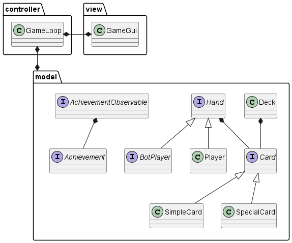

# Design architetturale

## Architettura complessiva
L'architettura complessiva è mostrata e riepilogata nel successivo diagramma UML:

Di seguito una breve descrizione per ogni componente illustrato:

- `Card` &rarr; Elemento principale del gioco, struttura base per ogni carta in gioco.
  - `SimpleCard` &rarr; Una carta semplice, che è caratterizzata da un colore e un numero.
  - `SpecialCard` &rarr; Una carta speciale, che ha un effetto particolare a seguito della propria giocata.

- `Deck` &rarr; Modello che rappresenta una collezione di carte non ordinata, semplici e speciali, che offre la possibilità di pescare da esso.
- `Hand` &rarr; Modello che anch'esso rappresenta una collezione di carte non ordinata, minore di quella del mazzo. Quest'ultimo componente è la
base di ogni giocatore e bot, in quanto rappresenta la mano di carte che ogni giocatore possiede durante una partita.

- `Player` &rarr; Componente che rappresenta un giocatore all'interno del gioco, che contiene una mano di carte gestibili durante una partita.
- `BotPlayer` &rarr; Unità fondamentale che rappresenta un bot generico, anch'esso presenta una mano gestibile, struttura base di ogni bot implementabile.

- `Achievement` &rarr; Componente che rappresenta un obiettivo da raggiungere durante una partita, che può essere di vario tipo.
- `AchievementObserver` &rarr; Interfaccia che rappresenta un osservatore di un obiettivo, che notifica il raggiungimento di un obiettivo.

- `GameLoop` &rarr; Componente cruciale che si occupa interamente di gestire e modellare la logica del gioco e il rispetto
delle regole durante lo svolgimento di ogni partita.
- `GameGui` &rarr; Interfaccia grafica in grado di mostrare le numerose interfacce
  presenti all'interno del programma quando viene richiesto.

## Pattern architetturali
Il pattern architetturale utilizzato per la creazione di questo progetto è MVC (Model-View-Controller).

Questo pattern è stato scelto in quanto permette di separare
la logica di business (Model) dalla interfaccia (View)
e dalla gestione degli eventi (Controller).
Questa separazione permette di rendere il codice più modulare e mantenibile,
in quanto ogni componente ha un compito ben definito e indipendente dagli altri.

All'interno del progetto, i package sono stati distribuiti proprio seguendo questo pattern architetturale:
- Controller
  - Contiene gli elementi che si occupano 
di gestire gli eventi del gioco e le azioni dei bot e dell'utente
- Model
  - Contiene i componenti principali necessari per lo svolgimento del gioco
- View
  - Contiene il necessario a formare quelle che saranno le interfacce grafiche del gioco

## Scelte tecnologiche
Per la realizzazione di questo progetto è stata utilizzata la versione 3.x di Scala. Per La gestione dei file in formato 
JSON è stato utilizzato il framework `Play-JSON`.

---

[Indice](../index.md) | [Capitolo Precedente](./2-Requisiti.md) | [Capitolo Successivo](./4-Design-dettaglio.md)