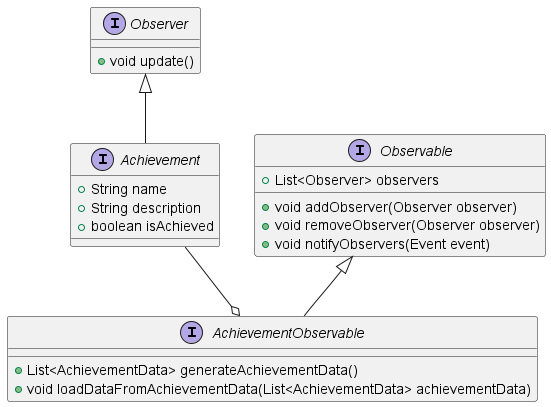

# Design di dettaglio

## Card
Una Card è un elemento chiave per l'intero svolgimento di una partita di UNO.
Una Carta è un elemento giocabile all'interno di una partita, che comprende dei valori e caratteristiche con
cui verranno effettuate delle operazioni o scelte durante lo svolgimento del gioco.

Una Card deve strettamente appartenere a uno dei seguenti tipi:
- `SimpleCard`
- `SpecialCard`

Sia le SimpleCard che le SpecialCard sono figlie dirette di Card.

La Card base è caratterizzata da due semplici attributi condivisi da tutte le carte:
- `color: Color` che rappresenta il colore della carta
- `image: Image` che rappresenta l'immagine della carta (ad uso esclusivamente grafico)

Per la gestione dei colori, onde evitare errori di tipo, si è deciso di creare un Enum `Color`
che rappresenta i colori possibili di una carta.

Per la creazione delle carte si è deciso di utilizzare un `CardFactory`, 
una Factory che è in grado di generare qualsiasi carta necessaria, sia Semplice che Speciale, in base all'esigenza.

### SimpleCard
Una SimpleCard è una carta base, che non ha particolari effetti o abilità speciali, è figlia diretta di Card e quindi 
eredita direttamente i suoi attributi, di cui principale importanza è il campo 'color', fondamentale nella 
gestione attiva del gioco.

Una SimpleCard ha poi modellato un altro attributo interno, che rappresenta il valore numerico della carta.
Quest'ultimo viene modellato tramite l'attributo `num: CardNumber`.

Nonostante il valore numerico sia un semplice intero, si è deciso di creare un Enum `CardNumber` che rappresenta esclusivamente
i valori possibili all'interno del gioco di Uno.
Questa scelta è stata fatta sia per evitare errori di tipo, sia per rendere il codice più leggibile e comprensibile, 
che per garantire una maggiore scalabilità del codice in futuro.

### SpecialCard
Una SpecialCard è una carta speciale, che è caratterizzata dalla presenza di un effetto particolare una volta che
un giocatore la gioca.

Anche la SpecialCard è figlia diretta di Card e quindi eredita direttamente i suoi attributi, 
di cui principale importanza è il campo 'color'.

L'unico particolare per quanto riguarda il colore delle SpecialCard è che alcune di esse
sono caratterizzate dal colore `BLACK`, che rappresenta un colore speciale.
Quest'ultimo risulta compatibile con tutti gli altri 4 colori disponibili.
Inoltre, le carte caratterizzate dal colore `BLACK` hanno la particolarità di cambiare colore a piacimento una volta
giocate.

Ogni SpecialCard ha al suo interno un metodo `execute` con lo scopo di avvisare il Controller 
del gioco di quale azione deve essere eseguita una volta che la carta viene giocata.
Ogni tipo di SpecialCard differente eseguirà l'override di questo metodo per eseguire l'azione corretta.

Sono presenti quattro tipi di SpecialCard, ognuna con un effetto diverso e unico: 
#### DrawCard
La DrawCard è una carta speciale che obbliga il giocatore successivo a pescare un numero di carte definito.

Esistono due tipi di DrawCard:
- `DrawTwoCard` che obbliga il giocatore successivo a pescare due carte. La carta è caratterizzata da uno dei 4
colori disponibili nel gioco.
- `DrawFourCard` che obbliga il giocatore successivo a pescare quattro carte. La carta è caratterizzata dal colore `BLACK` 
e ha la particolarità di cambiare il colore in gioco a piacimento una volta giocata.

#### SkipCard
La SkipCard è una carta speciale che obbliga il giocatore successivo a saltare il proprio turno.
Questa Carta notifica al Controller di saltare il turno del giocatore successivo, tramite il metodo `execute`.

Nel gioco base di UNO, una carta SkipCard fa saltare un solo turno, nel nostro progetto è
stato aggiunto un valore `numberToSkip: int` che rappresenta il numero di turni da saltare, nel caso si vogliano
modificare le regole di gioco in un futuro momento senza cambiare la struttura del codice.

Questa SpecialCard può essere caratterizzata dai 4 classici colori disponibili nel gioco.

#### ReverseCard
La ReverseCard è una carta speciale che inverte l'ordine di gioco attuale, da orario ad antiorario o viceversa.
Questa Carta notifica al Controller del cambiamento d'ordine tramite il metodo `execute`.

Questa SpecialCard può essere caratterizzata dai 4 classici colori disponibili nel gioco.

#### ChangeColor
La ChangeColor è una carta speciale che permette al giocatore di cambiare il colore in gioco a piacimento.

La carta è caratterizzata dal colore `BLACK`
e ha la particolarità di cambiare il colore in gioco a piacimento una volta giocata.

Questa Carta notifica al Controller della richiesta di cambio di colore tramite il metodo `execute`.

### Deck
Il Deck è una collezione di carte, che rappresenta il mazzo di carte da cui i giocatori pescano durante il gioco.

Durante la fase di inizializzazione del gioco, il Deck viene creato e autometicamente popolato 
da tutte le carte necessarie per una partita di UNO:

Si gioca con un mazzo di 108 carte così distribuite:
- 19 Carte per ogni colore disponibile (`Red`, `Blue`, `Green`, `Yellow`), numerate da 1 a 9 (2 serie) più uno 0
- 8 carte `DrawTwo` dei quattro colori sopracitati
- 8 carte `ReverseCard` dei quattro colori sopracitati
- 8 carte `SkipCard` dei quattro colori sopracitati
- 4 carte `ChangeColor`
- 4 carte `DrawFour`

Una volta create, le carte vengono mescolate in modo casuale.

Il Deck offre la possibilità di pescare una carta, rimuovendola dal mazzo, tramite il metodo `draw`, che ritorna poi
la carta pescata.

### Hand
Una Hand è una collezione di carte, che rappresenta la mano di un giocatore durante il gioco.
Una Hand è la base fondamentale sia per quanto riguarda il giocatore ma anche per i bot che partecipano alla partita.

Una Hand comprende le funzionalità necessarie alla gestione completa delle carte in essa contenute:

- `addCard` Aggiunge una carta alla mano.
- `removeCard` Rimuove una carta dalla mano.
- `getCardCount` Ritorna il numero di carte presenti nella mano.
- `hasCard` Verifica se una carta precisa è attualmente presente nella mano.
- `clearHand` Rimuove tutte le carte dalla mano, svuotandola.

### Player
Un Player è un giocatore umano e partecipante attivo alla partita di UNO.

Un Player è semplicemente un figlio diretto di Hand e viene gestito in maniera diretta dal Controller del gioco.

## Bots
A seguire un UML che mostra come sono strutturate le classi dei Bot:

## BotPlayer
Un BotPlayer è un giocatore non umano alla partita di UNO.
Anche il BotPlayer è un figlio diretto di Hand.
Viene gestito in maniera diretta dal Controller del gioco, le sue scelte e i suoi 
comportamenti sono completamente automatizzati.

Un BotPlayer non è direttamente istanziabile, ma è necessario utilizzare una delle due classi figlie:
- `EasyBotPlayerImpl`
- `HardBotPlayerImpl`

BotPlayer contiene due metodi comuni e fondamentali per lo svolgimento del gioco:
- `chooseCardToUse` che ritorna la carta scelta dal BotPlayer per essere giocata, se possibile e valida.
- `chooseColor` che ritorna il colore scelto dal BotPlayer in caso di carta `ChangeColor` o `DrawFour`.

### EasyBotPlayer
Un EasyBotPlayer è un BotPlayer che gioca in maniera casuale, senza particolari strategie o logiche.
La difficoltà di gioco è molto bassa, e il BotPlayer sceglie le carte da giocare in maniera casuale,
analizzando le
carte in mano con quella al centro del tavolo.
EasyBotPlayer non tiene conto del numero di carte degli altri giocatori e per giocare sceglie
semplicemente una carta casuale valida che possa essere giocata nel suo turno.
Nel caso non possieda alcuna carta valida da giocare, pesca una carta.

Per effettuare questa scelta, questa variante di BotPlayer effettua l'override del metodo `chooseCardToUse`, presente
nella classe BotPlayer, in modo da poter effettuare una scelta casuale tra le carte in mano.

### HardBotPlayer
Un HardBotPlayer è un BotPlayer che gioca in maniera più strategica e intelligente, cercando di massimizzare
le proprie possibilità di vittoria.

La strategia principale di un HardBotPlayer è quella di giocare le carte speciali per prima,
cercando di danneggiare gli avversari e di ottenere un vantaggio quando possibile.
HardBotPlayer non tiene conto del numero di carte degli altri giocatori e per giocare sceglie
semplicemente una carta valida che possa essere giocata nel suo turno in base alla sua strategia precedentemente
descritta.
Nel caso non possieda alcuna carta valida da giocare, pesca una carta.

Per effettuare questa scelta, questa variante di BotPlayer effettua l'override 
del metodo `chooseCardToUse`, presente
nella classe BotPlayer, in modo da poter effettuare una scelta accurata tra le carte in mano.

### Compatibility
Per regolare la compatibilità delle carte in gioco, è stato sviluppato un metodo
`isCompatible` che verifica se una carta è compatibile con la carta attualmente in gioco.

La verifica avviene in base a tutti i criteri possibili:
- Tipo di carta (SimpleCard o SpecialCard)
- Colore
- Numero (se presente)

## Achievements

Gli _Achievements_ sono obiettivi che i giocatori possono raggiungere durante una partita di UNO,
che vengono registrati e valutati dopo aver concluso una partita. La progettazione degli achievement è stata fatta
seguendo il pattern Observer, in modo da garantire una gestione modulare e flessibile degli obiettivi.

Nel diagramma si può osservare la struttura dei principali componenti che compongono il sistema di Achievements:
- `Achievement` &rarr; Interfaccia che definisce i metodi necessari per la gestione degli obiettivi.
- `AchievementObservable` &rarr; Interfaccia che definisce i metodi per la registrazione e la notifica degli osservatori.

Quando un evento di gioco si verifica, gli oggetti `Achievement` registrati come osservatori vengono notificati e 
valutano se l'obiettivo associato è stato raggiunto, aggiornando il proprio stato di conseguenza.

L'interfaccia `AchievementObservable` fornisce anche dei metodi per ottenere o caricare gli obiettivi raggiunti,
in modo da poter gestire uno storico delle prestazioni dei giocatori.

### AchievementController

Per gestire il caricamento, il salvataggio e la visualizzazione degli obiettivi del gioco, è stato progettato un
`AchievementController`, che coordina tutte le operazioni relative agli obiettivi. Questo controller centralizza 
le operazioni principali associate agli obiettivi, garantendo un'interfaccia unificata per la gestione degli stessi.

Le funzioni principali del `AchievementController` includono:
- Tiene traccia dei progressi di un giocatore e aggiorna gli obiettivi raggiunti in base agli eventi di gioco.
- Recupera gli obiettivi già raggiunti da un giocatore, leggendo i dati di salvataggio da un file.
- Registra e memorizza lo stato attuale degli obiettivi raggiunti da un giocatore.
- Fornisce un elenco aggiornato degli obiettivi che un giocatore ha sbloccato.
- ipristina lo stato degli obiettivi, consentendo di riavviare il progresso degli stessi come se fosse una nuova sessione.

Un aspetto chiave dell'implementazione del `AchievementController` è la separazione tra la logica degli obiettivi e i 
dati di salvataggio. Questo significa che la definizione di cosa costituisce un obiettivo e le regole che determinano 
il suo raggiungimento sono mantenute separate dalle informazioni che memorizzano quali obiettivi sono stati 
effettivamente sbloccati da un giocatore e in che stato si trovano.

Un ulteriore vantaggio di questo approccio è la robustezza nella gestione del caricamento dei dati degli obiettivi. 
Anche se in future versioni del gioco vengono definiti nuovi obiettivi, i dati di salvataggio delle versioni 
precedenti rimangono pienamente compatibili. Ciò è possibile perché il caricamento dei dati degli obiettivi avviene 
in base all'id univoco di ciascun obiettivo. Di conseguenza, i progressi di un giocatore possono essere correttamente 
mappati ai rispettivi obiettivi anche dopo l'introduzione di nuovi traguardi.

## Settings

Le impostazioni di gioco sono modellate attraverso un oggetto `Settings` che contiene i parametri principali:
- `difficulty`: Il livello di difficoltà del gioco, che è rappresentato da un enum.
- `startCardValue`: Il valore del numero di carte iniziali di tutti i giocatori.
- `handicap`: Un valore di handicap applicato al gioco per i bot, il quale può essere negativo o positivo.

L'oggetto deve essere serializzabile, in modo da poter essere salvato e caricato da file.

### SettingsManager e SettingsController

Le impostazioni di gioco sono gestite attraverso due componenti principali:
- `SettingsManager` &rarr; Si occupa di gestire il salvataggio e il caricamento delle impostazioni da file.
- `SettingsController` &rarr; Si occupa di gestire le operazioni connesse alle impostazioni, come la modifica e il salvataggio 
in un determinato path o richiamare il `SettingsManager` per il caricamento e il salvataggio delle impostazioni nel momento
opportuno.

## GameLoop
Il GameLoop è il cuore della logica del gioco, responsabile della gestione delle dinamiche di gioco, 
delle diverse fasi e delle interazioni tra i giocatori. I suoi metodi principali includono:

- `start` &rarr; Avvia il gioco, occupandosi dell'inizializzazione del mazzo di carte, della distribuzione delle mani ai giocatori e della preparazione del tavolo di gioco.
- `stop` &rarr; Termina il gioco e gestisce le operazioni di chiusura necessarie.
- `reverseTurnOrder` &rarr; Inverte l'ordine dei turni dei giocatori.
- `nextDrawCard` &rarr; Fa pescare un numero specifico di carte al giocatore successivo.
- `skipNextTurn` &rarr; Salta il turno del prossimo giocatore.
- `chooseCard` &rarr; Gioca una carta dalla mano del giocatore, se valida, e la rimuove dalla mano del giocatore.
- `drawCard` &rarr; Fa pescare una carta al giocatore di turno.
- `showChangeColor` &rarr; Mostra un'interfaccia per permettere al giocatore di selezionare un nuovo colore di gioco.
- `changeColor` &rarr; Cambia il colore attivo nel gioco in base alla scelta del giocatore.
- `callUno` &rarr; Gestisce la dichiarazione di "UNO" da parte del giocatore.
- `nextTurn` &rarr; Passa il turno al giocatore successivo.

## PageController
La PageController è una classe fondamentale per la gestione della navigazione e della visualizzazione delle 
diverse schermate all'interno dell'applicazione di gioco. Essa centralizza il controllo delle interfacce grafiche, 
rendendo fluide le transizioni tra le varie schermate e coordinando le operazioni connesse al ciclo di gioco. 
Grazie a questa struttura modulare, l'applicazione può essere facilmente estesa con nuove schermate
senza compromettere il flusso complessivo del programma.

## GameGui

La gui del gioco è stata sviluppata in modo da essere il più possibile intuitiva e semplice da utilizzare.
Si basa su una griglia di bottoni, di cui:
- l'ultima riga è dedicata alle carte del giocatore attuale.
- Vicino al centro é presente il mazzo di carte, l'ultima carta giocata e il bottone per chiamare uno.
- In alto a destra é presente un'immagine che rappresenta la direzione del gioco.
- Sopra ogni giocatore é presente una freccia che si rende visibile quando é il turno di quel giocatore.

---

[Indice](../index.md) | [Capitolo Precedente](./3-Design-architetturale.md) | [Capitolo Successivo](./5-Implementazione.md)