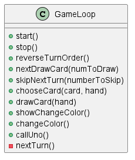

# Design di dettaglio

Design di dettaglio (scelte rilevanti, 
pattern di progettazione, 
organizzazione del codice -- corredato da pochi ma efficaci diagrammi)

## Card
Una Card è un elemento chiave per l'intero svolgimento di una partita di UNO.
Una Carta è un elemento giocabile all'interno di una partita, che comprende dei valori e caratteristiche con
cui verranno effettuate delle operazioni o scelte durante lo svolgimento del gioco.

Una Card deve strettamente appartenere a uno dei seguenti tipi:
- `SimpleCard`
- `SpecialCard`

Sia le SimpleCard che le SpecialCard sono figlie dirette di Card.

La Card base è caratterizzata da due semplici attributi condivisi da tutte le carte:
- `color: Color` che rappresenta il colore della carta
- `image: Image` che rappresenta l'immagine della carta (ad uso esclusivamente grafico)

Per la gestione dei colori, onde evitare errori di tipo, si è deciso di creare un Enum `Color`
che rappresenta i colori possibili di una carta.

Per la creazione delle carte si è deciso di utilizzare un `CardFactory`, 
una Factory che è in grado di generare qualsiasi carta necessaria, sia Semplice che Speciale, in base all'esigenza.

### SimpleCard
Una SimpleCard è una carta base, che non ha particolari effetti o abilità speciali, è figlia diretta di Card e quindi 
eredita direttamente i suoi attributi, di cui principale importanza è il campo 'color', fondamentale nella 
gestione attiva del gioco.

Una SimpleCard ha poi modellato un altro attributo interno, che rappresenta il valore numerico della carta.
Quest'ultimo viene modellato tramite l'attributo `num: CardNumber`.

Nonostante il valore numerico sia un semplice intero, si è deciso di creare un Enum `CardNumber` che rappresenta esclusivamente
i valori possibili all'interno del gioco di Uno.
Questa scelta è stata fatta sia per evitare errori di tipo, sia per rendere il codice più leggibile e comprensibile, 
che per garantire una maggiore scalabilità del codice in futuro.

### SpecialCard
Una SpecialCard è una carta speciale, che è caratterizzata dalla presenza di un effetto particolare una volta che
un giocatore la gioca.

Anche la SpecialCard è figlia diretta di Card e quindi eredita direttamente i suoi attributi, 
di cui principale importanza è il campo 'color'.

L'unico particolare per quanto riguarda il colore delle SpecialCard è che alcune di esse
sono caratterizzate dal colore `BLACK`, che rappresenta un colore speciale.
Quest'ultimo risulta compatibile con tutti gli altri 4 colori disponibili.
Inoltre, le carte caratterizzate dal colore `BLACK` hanno la particolarità di cambiare colore a piacimento una volta
giocate.

Ogni SpecialCard ha al suo interno un metodo `execute` con lo scopo di avvisare il Controller 
del gioco di quale azione deve essere eseguita una volta che la carta viene giocata.
Ogni tipo di SpecialCard differente eseguirà l'override di questo metodo per eseguire l'azione corretta.

Sono presenti quattro tipi di SpecialCard, ognuna con un effetto diverso e unico: 
#### DrawCard
La DrawCard è una carta speciale che obbliga il giocatore successivo a pescare un numero di carte definito.

Esistono due tipi di DrawCard:
- `DrawTwoCard` che obbliga il giocatore successivo a pescare due carte. La carta è caratterizzata da uno dei 4
colori disponibili nel gioco.
- `DrawFourCard` che obbliga il giocatore successivo a pescare quattro carte. La carta è caratterizzata dal colore `BLACK` 
e ha la particolarità di cambiare il colore in gioco a piacimento una volta giocata.

#### SkipCard
La SkipCard è una carta speciale che obbliga il giocatore successivo a saltare il proprio turno.
Questa Carta notifica al Controller di saltare il turno del giocatore successivo, tramite il metodo `execute`.

Nel gioco base di UNO, una carta SkipCard fa saltare un solo turno, nel nostro progetto è
stato aggiunto un valore `numberToSkip: int` che rappresenta il numero di turni da saltare, nel caso si vogliano
modificare le regole di gioco in un futuro momento senza cambiare la struttura del codice.

Questa SpecialCard può essere caratterizzata dai 4 classici colori disponibili nel gioco.

#### ReverseCard
La ReverseCard è una carta speciale che inverte l'ordine di gioco attuale, da orario ad antiorario o viceversa.
Questa Carta notifica al Controller del cambiamento d'ordine tramite il metodo `execute`.

Questa SpecialCard può essere caratterizzata dai 4 classici colori disponibili nel gioco.

#### ChangeColor
La ChangeColor è una carta speciale che permette al giocatore di cambiare il colore in gioco a piacimento.

La carta è caratterizzata dal colore `BLACK`
e ha la particolarità di cambiare il colore in gioco a piacimento una volta giocata.

Questa Carta notifica al Controller della richiesta di cambio di colore tramite il metodo `execute`.

### Deck
Il Deck è una collezione di carte, che rappresenta il mazzo di carte da cui i giocatori pescano durante il gioco.

Durante la fase di inizializzazione del gioco, il Deck viene creato e autometicamente popolato 
da tutte le carte necessarie per una partita di UNO:

Si gioca con un mazzo di 108 carte così distribuite:
- 19 Carte per ogni colore disponibile (`Red`, `Blue`, `Green`, `Yellow`), numerate da 1 a 9 (2 serie) più uno 0
- 8 carte `DrawTwo` dei quattro colori sopracitati
- 8 carte `ReverseCard` dei quattro colori sopracitati
- 8 carte `SkipCard` dei quattro colori sopracitati
- 4 carte `ChangeColor`
- 4 carte `DrawFour`

Una volta create, le carte vengono mescolate in modo casuale.

Il Deck offre la possibilità di pescare una carta, rimuovendola dal mazzo, tramite il metodo `draw`, che ritorna poi
la carta pescata.

### Hand
Una Hand è una collezione di carte, che rappresenta la mano di un giocatore durante il gioco.
Una Hand è la base fondamentale sia per quanto riguarda il giocatore ma anche per i bot che partecipano alla partita.

Una Hand comprende le funzionalità necessarie alla gestione completa delle carte in essa contenute:

- `addCard` Aggiunge una carta alla mano.
- `removeCard` Rimuove una carta dalla mano.
- `getCardCount` Ritorna il numero di carte presenti nella mano.
- `hasCard` Verifica se una carta precisa è attualmente presente nella mano.
- `clearHand` Rimuove tutte le carte dalla mano, svuotandola.

### Player
Un Player è un giocatore umano e partecipante attivo alla partita di UNO.

Un Player è semplicemente un figlio diretto di Hand e viene gestito in maniera diretta dal Controller del gioco.

## BotPlayer
Un BotPlayer è un giocatore non umano alla partita di UNO.
Anche il BotPlayer è un figlio diretto di Hand.
Viene gestito in maniera diretta dal Controller del gioco, le sue scelte e i suoi 
comportamenti sono completamente automatizzati.

Un BotPlayer non è direttamente istanziabile, ma è necessario utilizzare una delle due classi figlie:
- `EasyBotPlayerImpl`
- `HardBotPlayerImpl`

BotPlayer contiene due metodi comuni e fondamentali per lo svolgimento del gioco:
- `chooseCardToUse` che ritorna la carta scelta dal BotPlayer per essere giocata, se possibile e valida.
- `chooseColor` che ritorna il colore scelto dal BotPlayer in caso di carta `ChangeColor` o `DrawFour`.

### EasyBotPlayer
Un EasyBotPlayer è un BotPlayer che gioca in maniera casuale, senza particolari strategie o logiche.
La difficoltà di gioco è molto bassa, e il BotPlayer sceglie le carte da giocare in maniera casuale,
analizzando le
carte in mano con quella al centro del tavolo.
EasyBotPlayer non tiene conto del numero di carte degli altri giocatori e per giocare sceglie
semplicemente una carta casuale valida che possa essere giocata nel suo turno.
Nel caso non possieda alcuna carta valida da giocare, pesca una carta.

Per effettuare questa scelta, questa variante di BotPlayer effettua l'override del metodo `chooseCardToUse`, presente
nella classe BotPlayer, in modo da poter effettuare una scelta casuale tra le carte in mano.

### HardBotPlayer
Un HardBotPlayer è un BotPlayer che gioca in maniera più strategica e intelligente, cercando di massimizzare
le proprie possibilità di vittoria.

La strategia principale di un HardBotPlayer è quella di giocare le carte speciali per prima,
cercando di danneggiare gli avversari e di ottenere un vantaggio quando possibile.
HardBotPlayer non tiene conto del numero di carte degli altri giocatori e per giocare sceglie
semplicemente una carta valida che possa essere giocata nel suo turno in base alla sua strategia precedentemente
descritta.
Nel caso non possieda alcuna carta valida da giocare, pesca una carta.

Per effettuare questa scelta, questa variante di BotPlayer effettua l'override 
del metodo `chooseCardToUse`, presente
nella classe BotPlayer, in modo da poter effettuare una scelta accurata tra le carte in mano.

### Compatibility
Per regolare la compatibilità delle carte in gioco, è stato sviluppato un metodo
`isCompatible` che verifica se una carta è compatibile con la carta attualmente in gioco.

La verifica avviene in base a tutti i criteri possibili:
- Tipo di carta (SimpleCard o SpecialCard)
- Colore
- Numero (se presente)

## Achievements

### AchievementObservable

### AchievementController

## Settings

### SettingsController

## GameLoop
Per gestire il loop di gioco, è stato sviluppato un GameLoop che si occupa della 
gestione del gioco in generale, delle fasi di gioco e delle interazioni tra i vari giocatori.
I metodi principali del GameLoop sono i seguenti raffigurati nel diagramma UML:

Questi metodi sono:
- `start` che inizia il gioco, inizializzando il mazzo di carte, le mani dei giocatori e il tavolo di gioco.
- `stop` che termina il gioco.
- `reverseTurnOrder` che inverte l'ordine di gioco.
- `nextDrawCard` che fa pescare al giocatore successivo un numero di carte definito.
- `skipNextTurn` che fa saltare il turno al giocatore successivo.
- `chooseCard` che data una carta, se giocabile, la gioca e la rimuove dalla mano del giocatore.
- `drawCard` che fa pescare una carta al giocatore attuale.
- `showChangeColor` che mostra la finestra di dialogo per la scelta del colore da parte del giocatore.
- `changeColor` che cambia il colore in gioco.
- `callUno` che notifica la chiamata di UNO da parte del giocatore.
- `nextTurn` che passa al turno successivo.

## GUI Generale che è gestita da un PageController che si occupa di gestire e switchare le varie cards

### PageController
La classe PageController è stata sviluppata per gestire la logica di navigazione e visualizzazione delle diverse schermate all'interno 
dell'applicazione di gioco. Questa classe svolge un ruolo cruciale nell'organizzazione delle varie interfacce grafiche, 
facilitando la transizione tra di esse e mantenendo un controllo centralizzato sulle operazioni relative al ciclo di gioco.
Grazie a questa struttura, è possibile estendere facilmente l'applicazione aggiungendo nuove schermate o modificando il 
comportamento di quelle esistenti senza alterare il flusso generale del programma.

### GameGui

La gui del gioco è stata sviluppata in modo da essere il più possibile intuitiva e semplice da utilizzare.
Si basa su una griglia di bottoni, di cui:
- l'ultima riga è dedicata alle carte del giocatore attuale.
- Vicino al centro é presente il mazzo di carte, l'ultima carta giocata e il bottone per chiamare uno.
- In alto a destra é presente un'immagine che rappresenta la direzione del gioco.
- Sopra ogni giocatore é presente una freccia che si rende visibile quando é il turno di quel giocatore.

Esistono questi tipi di celle:
- `CardCell` : cella che contiene una carta e permette di giocarla.
- `DeckCell` : cella che contiene il mazzo di carte e permette di pescare.
- `UnoCell` : cella che permette di chiamare uno.
- `DirectionCell` : cella che contiene l'immagine che rappresenta la direzione del gioco.
- `UsedCardCell` : cella che contiene l'ultima carta giocata.

Tutte queste celle sono contenute in un `GridLayout` che permette di visualizzarle in modo ordinato e di gestirne la posizione.

---

[Indice](../index.md) | [Capitolo Precedente](./3-Design-architetturale.md) | [Capitolo Successivo](./5-Implementazione.md)